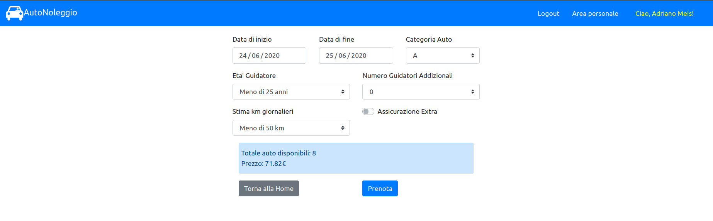

# Exam #1: "Noleggio Auto"
## Student: s276072 BARCO LUCA 

## React client application routes

- Route `/home`: 
  - Pagina home dell'applicazione, contiene la lista dei veicoli presenti nel parco auto e i filtri per marca e categoria
  
- Route `/login`:
  - Pagina di accesso all'area personale
  
- Route `/utente/prenota`: 
  - Pagina in cui un utente già autenticato può interagire con il configuratore interattivo per effettuare una nuova prenotazione. In questa pagina l'utente viene guidato fino al corretto pagamento e alla conferma dell'avvenuta prenotazione del veicolo. La pagina contiene il configuratore automatico ed il form di pagamento (visualizzato solo dopo l'esplicita accettazione dell'utente della proposta di prenotazione fatta dal configuratore interattivo)
  
- Route `/utente/storico`: 
  - Pagina in cui un utente già autenticato può accedere allo storico dei suoi noleggi, potendo eliminare quelli futuri. La pagina contiene la lista dei noleggi dell'utente divisi per noleggi passati (già finiti), attivi (alla data odierna) e futuri (gli unici per cui è presente un tasto per l'eliminazione)

## REST API server

### API Pubbliche
- GET `/api/auto?marca=..&categoria=..`
  - request URL parameters: 
    - marca (opzionale)
    - modello  (opzionale)
    
  Si possono specificare per ricevere solo i record relativi alle auto di quella marca e/o di quella categoria. Sono opzionali,perciò se non vengono specificati vengono ritornati i record relativi a tutti i veicoli presenti nel parco auto.

  - response body: contiene l'elenco delle auto presenti nel parco auto e i record sono nel formato 
    - categoria
    - marca
    - modello
    - quantità 
    
  (ex. [A,Fiat,Panda,3] indica che nel parco auto ci sono 3 auto di categoria A Fiat Panda )

- POST `/api/login`
  - request body: 
    - username
    - password
  
  - response body: contiene il token per l'accesso

- POST `/api/logout`
  - request body: vuoto
  - response body: vuoto
  
### API Autenticate, accessibili solo tramite token

- GET `/api/utente`
  - response body content: contiene
    -  user id
    -  username 
    dell'utente che risulta autenticato con il token. Ritorna un errore nel caso di utente non autenticato o utente non presente nel database
  

- GET `/api/utente/cercaAutoDisponibili?start=..&end=..&categoria=..&guidatori=..&km=..&assicurazione=..`
  - request parameters: parametri di ricerca per le auto disponibili in un certo intervallo di tempo e per una categoria.
    - category     :   categoria del veicolo (A,B,C,D,E)
    - startDate    :   data di inizio del noleggio (formato YYYY-MM-DD)
    - endDate      :   data di fine del noleggio (formato YYYY-MM-DD)
    - nDrivers     :   numero guidatori aggiuntivi (da 0 a 4)
    - ageDriver    :   età del primo guidatore (1: meno di 25 anni, 2:tra 25 e 65 anni,3:più di 65 anni),
    - nKm          :   numero km giornalieri (1: meno di 50,2: tra 50 e 150,3: più di 150),
    - extraInsurance: assicurazione extra (true,false)
  
  I parametri start,end e categoria sono obbligatori (indicano le date di inizio e fine noleggio e la categoria dell'auto a cui si è interessati). Gli altri sono opzionali e servono solo al calcolo del prezzo della proposta di noleggio.
 
  - response body content: oggetto json  contenente
    - number  : numero di auto disponibili
    - price   : prezzo
  
  il numero di auto disponibili della categoria specificata per quel periodo di tempo e il prezzo per noleggiarne una.

- GET `/api/utente/storico`: restituisce lo storico dei noleggi dell'utente autenticato
  - response body content: oggetto json contentente record nel formato
    - id              : id del noleggio
    - id_utente       : id dell'utente
    - id_auto         : id dell'auto assegnata a quel noleggio
    - marca           : marca dell'auto assegnata a quel noleggio
    - modello         : modello dell'auto assegnata a quel noleggio
    - categoria       : categoria dell'auto assegnata a quel noleggio (A,B,C,D,E)
    - price           : prezzo del noleggio
    - startDate       : data di inizio del noleggio (formato YYYY-MM-DD)
    - endDate         : data di fine del noleggio (formato YYYY-MM-DD)
    - nDrivers        : numero di guidatori aggiuntivi  (da 0 a 4)
    - nKm             : numero di km giornalieri 1: meno di 50,2: tra 50 e 150,3: più di 150)
    - extraInsurance  : assicurazione Extra (true,false)

- POST `/api/utente/prenota` : crea un nuovo record di prenotazione nel database che verrà confermato dopo il pagamento
  - request body content: contiene i parametri per la prenotazione
    - category    :   categoria del veicolo (A,B,C,D,E)
    - startDate   :   data di inizio del noleggio (formato YYYY-MM-DD)
    - endDate     :   data di fine del noleggio (formato YYYY-MM-DD)
    - nDrivers    :   numero guidatori aggiuntivi (da 0 a 4)
    - ageDriver   :   età del primo guidatore (1: meno di 25 anni, 2:tra 25 e 65 anni,3:più di 65 anni)
    - nKm         :   numero km giornalieri (1: meno di 50,2: tra 50 e 150,3: più di 150)
    - extraInsurance: assicurazione extra (true,false)

  - response body content: contiene i dati dell'auto selezionata per la prenotazione e l'id
    - carId           :   auto.id
    - reservationId   :   idBook
    - marca           :   auto.marca
    - modello         :   auto.modello
  
- PUT `/api/utente/prenota/:id` : paga e conferma la prenotazione del noleggio - fatta con il verbo post dato che va ad aggiornare solo un campo di un record già esistente nel database
  - request parameters: id della prenotazione
  - request body content: dati di pagamento
    - name    : nome del titolare della carta di credito
    - number  : numero della carta di credito (16 numeri)
    - CVV     : codice CVV della carta di credito (3 numeri)
    - price   : prezzo da pagare
  
  - response body content: contiene un messaggio di log sulla buona riuscita dell'operazione
  
- DELETE `/api/utente/prenota/:id` : rimuove la prenotazione con l'id specificato
  - request parameters: id della prenotazione
  - response body content: contiene un messaggio di log sulla buona riuscita dell'operazione

## Server database

- Tabella `utente` : tabella per salvare gli utenti.
  - id
  - nome
  - username
  - password

- Tabella `automobile` : tabella per salvare le automobili presenti nel parco auto. Per una stessa coppia (maca,modello) possono esserci più record.
  - id
  - marca
  - modello
  - categoria

- Tabella `noleggio` : tabella per gestire i noleggi.
  - id
  - id_auto
  - id_utente
  - data_inizio
  - data_fine
  - nGuidatori
  - etaGuidatori
  - kmStimati
  - assicurazioneExtra
  - prezzo
  - pagato
  - timestamp

  I campi `pagato` e `timestamp` servono per gestire la prenotazione dell'auto.
  Quando l'utente "accetta" la proposta di noleggio fornita dal configuratore interattivo, nel database viene aggiunto un record con  pagato = 0.
  Quando l'utente paga, conferma la prenotazione e si aggiorna il record settando pagato = 1.
  Nel caso in cui l'utente esca  volontariamente dalla pagina di pagamento viene inviata una richiesta di rimozione del record della prenotazione.
  Se invece il suo token dovesse scadere proprio nell'intervallo di tempo tra l'accettazione della proposta di noleggio e il pagamento, il record rimane nel database solo per 10 minuti, dopodichè verrà eliminato (Ogni minuto, in server.js, viene eseguito un setInterval che elimina dalla tabella tutte le prenotazioni non ancora pagate e più vecchie di 10 minuti).

## Main React Components

- `App.js`:
  - Componente alla base dell'applicazione: contiene le Route, gestisce nello stato la presenza di un utente loggato ed è responsabile dell'elenco delle auto da mostrare nella home.
  
- `CarList.js`:
  - Componente che si occupa di visualizzare la lista di veicoli presenti nel parco auto
  
- `Filters.js`:
  - Componente che contiene i filtri con cui gestire la navigazione interattiva del parco auto (richiama funzioni handler del componente App per aggiornare i dati da visualizzare)

- `LoginForm.js`:
  - Componente contenente il form per il login
  
- `BookingForm.js`:
  - Componente che contiene il configuratore interattivo e gestisce nel suo stato la prenotazione che l'utente eventualmente deciderà di portare avanti. Gestisce il flusso d'esecuzione dalla ricerca tramite configuratore interattivo fino al pagamento e alla conferma della prenotazione.

- `BookingList.js`:
  - Componente che contiene lo storico delle prenotazioni dell'utente autenticato, e le gestisce nel suo stato.

(only _main_ components, minor ones may be skipped)

## Screenshot

## Test users

| username | password | |
|-----------|-------------|------------|
| adrianoMeis@auto.it| r0m4! | (frequent customer)|
| giovanniF@auto.it | passw0rd?| (frequent customer)
| gennaroEsp@auto.it | p1n0d4n13l3! ||
| marcella12@auto.it | #kttv12||
| elettraL@auto.it | @p3mp3m#||