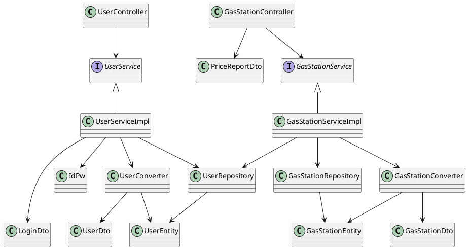

# Integration and API Test Documentation

Authors: 
Barco Luca Di Vincenzo Alessandro Pappalardo Marco Giulio Lorenzo Petruzzi Rocco Luigi 

Date: 25/05/2020

Version:

# Contents

- [Dependency graph](#dependency graph)

- [Integration and API Test Documentation](#integration-and-api-test-documentation)
- [Contents](#contents)
- [Dependency graph](#dependency-graph)
- [Integration approach](#integration-approach)
- [Tests](#tests)
  - [Step 0](#step-0)
  - [Step 1](#step-1)
  - [Step 2 API Tests](#step-2-api-tests)
- [Scenarios](#scenarios)
  - [Scenario UC1.1](#scenario-uc11)
  - [Scenario UC1.2](#scenario-uc12)
  - [Scenario UC1.3](#scenario-uc13)
  - [Scenario UC1.4](#scenario-uc14)
  - [Scenario UC2.1](#scenario-uc21)
  - [Scenario UC2.2](#scenario-uc22)
  - [Scenario UC3.1](#scenario-uc31)
  - [Scenario UC3.2](#scenario-uc32)
  - [Scenario UC4.1](#scenario-uc41)
  - [Scenario UC5.1](#scenario-uc51)
  - [Scenario UC6.1](#scenario-uc61)
  - [Scenario UC7.1](#scenario-uc71)
  - [Scenario UC7.2](#scenario-uc72)
  - [Scenario UC7.3](#scenario-uc73)
  - [Scenario UC7.4](#scenario-uc74)
  - [Scenario UC8.1](#scenario-uc81)
  - [Scenario UC8.2](#scenario-uc82)
  - [Scenario UC8.3](#scenario-uc83)
  - [Scenario UC9.1](#scenario-uc91)
- [Coverage of Scenarios and FR](#coverage-of-scenarios-and-fr)
- [Coverage of Non Functional Requirements](#coverage-of-non-functional-requirements)

# Dependency graph 

     
# Integration approach

A mixed approach has been used for the integration testing

#  Tests

## Step 0
| Classes  | JUnit test cases |
|--|--|
|User , UserDto| unit tests|
|GasStation, GasStationDto| unit tests|
| PriceReportDto, IdPw, LoginDto | unit tests|

## Step 1
| Classes  | JUnit test cases |
|--|--|
|UserConverter ,GasStationConverter| it.polito.ezgas.UserConverterTest, it.polito.ezgas.GasStationConverterTest|
|UserRepository, GasStationRepository| it.polito.ezgas.UserRepositoryTest, it.polito.ezgas.GasStationRepositoryTest|
|UserService | it.polito.ezgas.UserServiceTest|
|GasStationService| it.polito.ezgas.GasStationServiceTest|

## Step 2 API Tests
| Classes  | JUnit test cases |
|--|--|
|UserService | it.polito.ezgas.UserServiceAPITest|
|GasStationService| it.polito.ezgas.GasStationServiceAPITest|

# Scenarios

## Scenario UC1.1

| Scenario |  Create User Account with a valid email|
| ------------- |:-------------:| 
|  Precondition     | Account U does not exist |
|  Post condition     |  Account U added to the system |
| Step#        | Description  |
|  1     |  New User fills the new account fields and submits them |
| 2      |  Check that there isn't yet an account associated with that email |  
|  3     |  The account is added to the system with trust level = 0 and an autogenerated id|

## Scenario UC1.2

| Scenario |  Create User Account with an invalid email|
| ------------- |:-------------:| 
|  Precondition     | Account U does not exist |
|  Post condition     |  Account U not added to the system |
| | U.trust_level=0 |
| Step#        | Description  |
|  1     |  New User fills the new account fields and submits them |
| 2      |  Check that there already is an account associated with that email |  
|  3     |  The account is not added in the system |

## Scenario UC1.3

| Scenario |  Admin creates a new User Account with a valid email|
| ------------- |:-------------:| 
|  Precondition       | Account U does not exist |
|  Post condition     |  Account U added to the system |
|                     | U.trust_level=0 |
| Step#        | Description  |
|  1     |  Admin fills the new account fields and submits them |
|  2     |  Check that there isn't yet an account associated with that email |  
|  3     |  The account is added to the system with U.trust_level=0  |

## Scenario UC1.4

| Scenario |  Admin creates a new User Account with an invalid email|
| ------------- |:-------------:| 
|  Precondition       | Account U does not exist |
|  Post condition     |  Account U added in the system |
|                     | U.trust_level=0 |
| Step#        | Description  |
|  1     |  Admin fills the new account fields and submits them |
|  2     |  Check that there already is an account associated with that email |  
|  3     |  The account is not added in the system   |

## Scenario UC2.1

| Scenario |  User updates his Account|
| ------------- |:-------------:| 
|  Precondition       | Account U  exists |
|  Post condition     |  Account U updated |
| Step#        | Description  |
|  1     |  User fills the new fields about his account and submits them |
|  2     |  The account is updated  |

## Scenario UC2.2

| Scenario |  Admin updates an User Account|
| ------------- |:-------------:| 
|  Precondition       | Account U  exist |
|  Post condition     |  Account U updated |
| Step#        | Description  |
|  1     |  Admin chooses the user to update|
|  2     |  Admin fills the new fields and submits them |
|  2     |  The account is updated  |

## Scenario UC3.1

| Scenario |  User deletes his Account|
| ------------- |:-------------:| 
|  Precondition       | Account U  exists |
|  Post condition     |  Account U deleted from the system |
| Step#        | Description  |
|  1     |  User deletes his account|
|  2     |  The account is deleted  |

## Scenario UC3.2

| Scenario |  Admin deletes an User Account|
| ------------- |:-------------:| 
|  Precondition       | Account U  exists |
|  Post condition     |  Account U deleted from the system |
| Step#        | Description  |
|  1     | Admin chooses the User account to delete|
|  2     |  The account is deleted  |

## Scenario UC4.1

| Scenario |  Create Gas Station |
| ------------- |:-------------:| 
|  Precondition     | Gas Station GS does not exist |
|  Post condition     |  Gas Station GS created |
| Step#        | Description  |
|  1     |  The administrator tells the system he wants to create a new GS |  
|  2     |  All fields of GS are compiled |
|  3     |  The GS receives a unique ID   |
|  4     |  GS created and available      |

## Scenario UC5.1

| Scenario |  Modify Gas Station information |
| ------------- |:-------------:| 
|  Precondition     | Gas Station GS exists |
|  Post condition     |  Gas Station GS modified |
| Step#        | Description  |
|  1     |  The administrator selects a GS |
|  2     |  The administrator tells the system he wants to modify the GS  |  
|  3     |  All fields of GS are re-compiled |
|  4     |  GS updated         |

## Scenario UC6.1

| Scenario |  Delete Gas Station |
| ------------- |:-------------:| 
|  Precondition     | Gas Station GS exists |
|  Post condition     |  Gas Station GS deleted |
| Step#        | Description  |
|  1     |  The administrator selects a GS |
|  2     |  The administrator tells the system he wants to delete the GS  |   
|  3     |  GS deleted         |

## Scenario UC7.1

| Scenario |  Price list is modified |
| ------------- |:-------------:| 
|  Precondition     | Gas Station GS exists |
|                    | User U is registered in the system  |
| | G has an attached price list uploaded by U2  |
|  Post condition     |   Price list P is updated       |
|                     | P.time_tag is set to the current timestamp of the system |
| | P is attached to G |
| | U is attached to P     |
| Step#        | Description  |
|  1     |  The user selects a GS |
|  2     |  The user selects new report  |   
|  3     |  User inserts prices for GS(only the available ones) |
|  4     |  System checks that U.trust_level >= U2.trust_level |
| 5 |System checks that the updated informations are valid|
|6| GS updated|

## Scenario UC7.2

| Scenario |  Price list is created |
| ------------- |:-------------:| 
|  Precondition     | Gas Station GS exists |
|                    | User U is registered in the system  |
| | G has an attached price list uploaded by U2  |
|  Post condition     |   Price list P is updated       |
|                     | P.time_tag is set to the current timestamp of the system |
| | P is attached to G |
| | U is attached to P     |
| Step#        | Description  |
|  1     |  The user selects a GS |
|  2     |  The user selects new report  |   
|  3     |  User inserts prices for GS(only the available ones) |
|  4     |  U.trust_level < U2.trust_level && (today - P.time_tag ) > 4 days  |
| 5 |System checks that the updated informations are valid|
|6| GS updated|

## Scenario UC7.3

| Scenario |  name |
| ------------- |:-------------:| 
|  Precondition     | Gas Station GS exists |
|                    | User U is registered in the system  |
| | G has an attached price list uploaded by U2  |
|  Post condition     |   Price list P is updated       |
|                     | P.time_tag is set to the current timestamp of the system |
| | P is attached to G |
| | U is attached to P     |
| Step#        | Description  |
|  1     |  The user selects a GS |
|  2     |  The user selects new report  |   
|  3     |  User inserts prices for GS(only the available ones) |
|  4     |  U.trust_level < U2.trust_level && (today - P.time_tag ) < 4 days  |
|5| GS not updated|

## Scenario UC7.4

| Scenario |  name |
| ------------- |:-------------:| 
|  Precondition     | Gas Station GS exists |
|                    | User U is registered in the system  |
| | G has no attached price list   |
|  Post condition     |   Price list P is created        |
|                     | P.time_tag is set to the current timestamp of the system |
| | P is attached to G |
| | U is attached to P     |
| Step#        | Description  |
|  1     |  The user selects a GS |
|  2     |  The user selects new report  |   
|  3     |  User inserts prices for GS(only the available ones) |
| 4 |System checks that the updated informations are valid|
|5| GS updated|

## Scenario UC8.1

| Scenario |  name |
| ------------- |:-------------:| 
|  Precondition     | - |
|  Post condition     | -     |
| Step#        | Description  |
|  1     |  The user inserts an address |
|  2     |  System retrieves coordinates of the address  |   
|  3     |  GS in 1 km radius are shown |

## Scenario UC8.2

| Scenario |  name |
| ------------- |:-------------:| 
|  Precondition     | - |
|  Post condition     | -     |
| Step#        | Description  |
|  1     |  The user inserts an address a fuel type and a carsharing company |
|  2     |  System retrieves coordinates of the address and filters them by fuel type and car sharing |   
|  3     |  GS in 1 km radius are shown |

## Scenario UC8.3

| Scenario |  name |
| ------------- |:-------------:| 
|  Precondition     | - |
|  Post condition     | -     |
| Step#        | Description  |
|  1     |  The user inserts a fuel type and a carsharing company |
|  2     |  System retrieves GS and filters them by fuel type and car sharing |   
|  3     | Filtered GSs are shown |

## Scenario UC9.1

| Scenario |  name |
| ------------- |:-------------:| 
|  Precondition     | price list P is attached to user U |
|  Post condition     | P.trust_level = 50 * (U.trust_level +5)/10 + 50 * obsolescence    |
||obsolescence = 0 if (today - P.time_tag) > 7 days|
||otherwise obsolescence = 1 - (today - P.time_tag)/7|
| Step#        | Description  |
|  1     |  GS ReportDependability is updated every day |

# Coverage of Scenarios and FR

it.polito.ezgas package assumed for all classes

| Scenario ID | Functional Requirements covered | JUnit  Test(s) | 
| ----------- | ------------------------------- | ----------- | 
| UC1.1       |   FR1.1, FR1.4                   | UserServiceAPITests.TC1_saveUser, UserServiceTests.TC1_saveUser,UserRepositoryTests.TestfindByEmail ,UserConverterTest.testToUserDto, UserConverterTest.testToUser |
| UC1.2       |   FR1.1, FR1.4                   | UserServiceAPITests.TC2_saveUser, UserServiceTests.TC2_saveUser,UserRepositoryTests.TestfindByEmail, UserConverterTest.testToUserDto, UserConverterTest.testToUser |
| UC1.3       |   FR1.1, FR1.4           | UserServiceAPITests.TC1_saveUser, UserServiceTests.TC1_saveUser,UserRepositoryTests.TestfindByEmail UserConverterTest.testToUserDto, UserConverterTest.testToUser|
| UC1.4       |   FR1.1, FR1.4           | UserServiceAPITests.TC2_saveUser, UserServiceTests.TC2_saveUser,UserRepositoryTests.TestfindByEmail, UserConverterTest.testToUserDto, UserConverterTest.testToUser |
| UC2.1       |   FR1.1                         | UserServiceAPITests.TC3_saveUser, UserServiceTests.TC3_saveUser |
| UC2.2       |   FR1.1, FR1.3, FR1.4           | UserServiceAPITests.TC3_saveUser, UserServiceTests.TC3_saveUser,UserRepositoryTests.TestfindByEmail, UserConverterTest.testToUserDto, UserConverterTest.testToUserUserConverterTest.testToUserDtoList  |
| UC3.1       |   FR1.2, FR1.3                         | UserServiceAPITests.TC1_deleteUser, UserServiceTests.TC1_deleteUser  |
| UC3.2       |   FR1.2, FR1.3, FR1.4           | UserServiceAPITests.TC1_deleteUser, UserServiceTests.TC1_deleteUser|
| UC4.1 | FR3.1, FR4 |GasStationServiceAPITests.TC1_saveGasStation, GasStationServiceTests.TC1_saveGasStation,GasStationConverterTest.testToGasStationDto, GasStationConverterTest.testToGasStation |
| UC5.1| FR3.1, FR4 |GasStationServiceAPITests.TC1_saveGasStation, GasStationServiceTests.TC1_saveGasStation,GasStationConverterTest.testToGasStationDto, GasStationConverterTest.testToGasStation|
| UC6.1| FR3.2, FR3.3 | GasStationServiceAPITests.TC1_deleteGasStation, GasStationServiceTests.TC1_deleteGasStation |
| UC7.1| FR1.4 FR3.1 FR5.1|GasStationServiceAPITests.TC1_setReport, GasStationServiceTests.TC1_setReport |
| UC7.2| FR1.4 FR3.1 FR5.1|GasStationServiceAPITests.TC3_setReport, GasStationServiceTests.TC3_setReport |
| UC7.3| FR1.4 FR3.1 FR5.1|GasStationServiceAPITests.TC4_setReport, GasStationServiceTests.TC4_setReport |
| UC7.4| FR1.4 FR3.1 FR5.1|GasStationServiceAPITests.TC5_setReport, GasStationServiceTests.TC5_setReport |
| UC8.1| FR4.2 |GasStationServiceAPITests.TC2_getGasStationByProximity, GasStationServiceTests.TC1_getGasStationByProximity,GasStationConverterTest.testToGasStationDtoList  |
| UC8.2| FR4.5|GasStationServiceAPITests.TC8_getGasStationWithCoordinates, GasStationServiceTests.TC1_getGasWithCooordinates GasStationConverterTest.testToGasStationDtoList  |
| UC8.3 | FR4.3, FR4.4|GasStationServiceAPITests.TC7_getGasStationWithoutCoordinates, GasStationServiceTests.TC1_getGasWithoutCooordinates GasStationConverterTest.testToGasStationDtoList |
| UC9.1| FR5.2| GasStationServiceAPITests.TC5_setReport, GasStationServiceTests.TC5_setReport   |
| UC10.1| FR4, FR5.3 | UserServiceAPITests.TC2_increaseUserReputation, UserServiceTests.TC2_increaseUserReputation, UserServiceAPITests.TC3_increaseUserReputation, UserServiceTests.TC3_increaseUserReputation|
| UC10.2| FR4, FR5.3 |TC1_decreaseUserReputation, TC1_decreaseUserReputation, TC2_decreaseUserReputation, TC2_decreaseUserReputation|

# Coverage of Non Functional Requirements

No avaiable framework can tests non functional requirements.

NFR2 could be tested, but backend performance is  insufficent to estimate total performance.

