# Graphical User Interface Prototype  

Authors: 
Barco Luca Di Vincenzo Alessandro Pappalardo Marco Giulio Lorenzo Petruzzi Rocco Luigi 

Date: 19/04/2020

Version:

#UC1:

- Registration

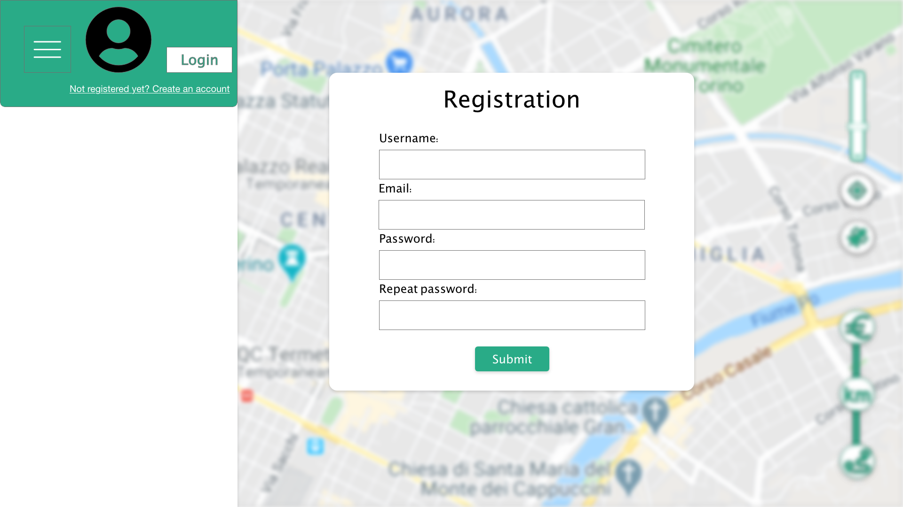

- Login

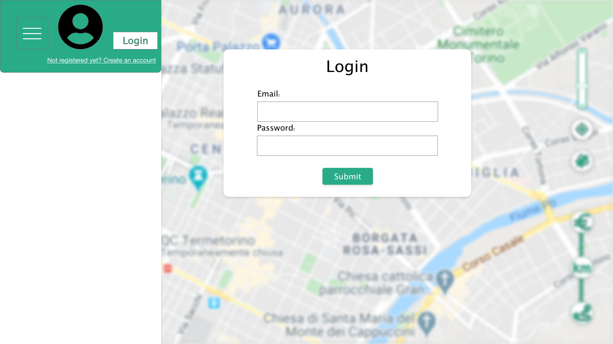

#UC2:

- Visualize the list of gas stations around user's GPS location

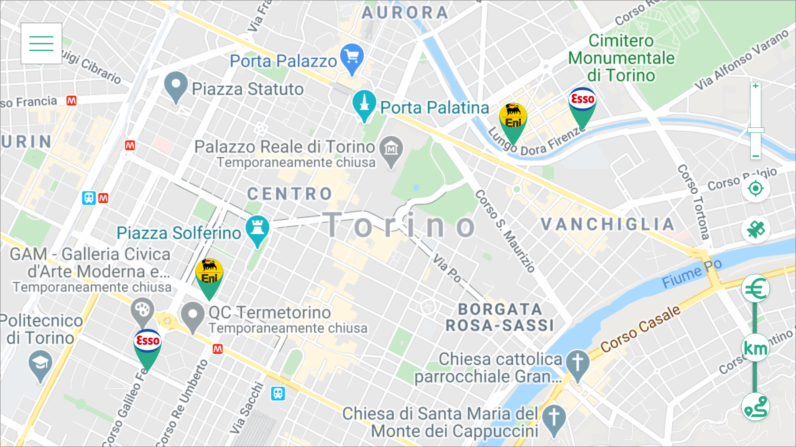

#UC3:

- Get the route

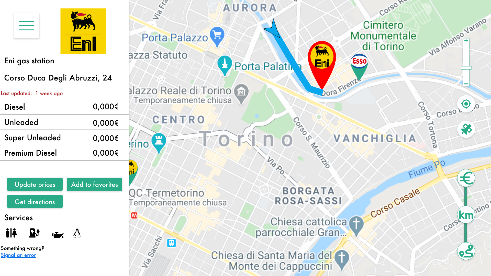

#UC4:

- Manage Feedback about prices

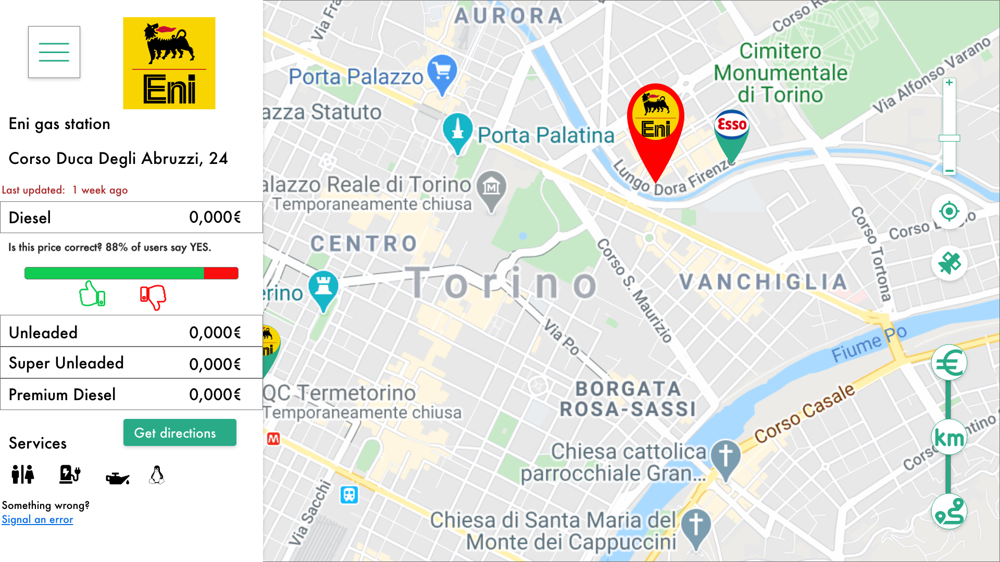

#UC5, UC6:

- Manage Feedback about gas station's information (location, ...)
- Insert/modify a fuel type price for a gas station

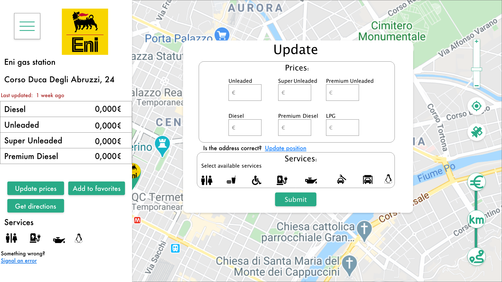

#UC7:

- Add a new gas station

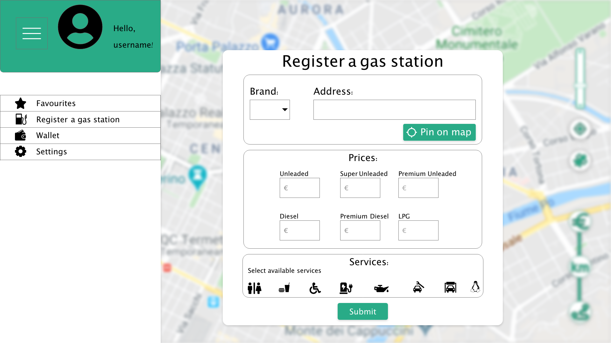

#UC8
- Signal a close gas station 
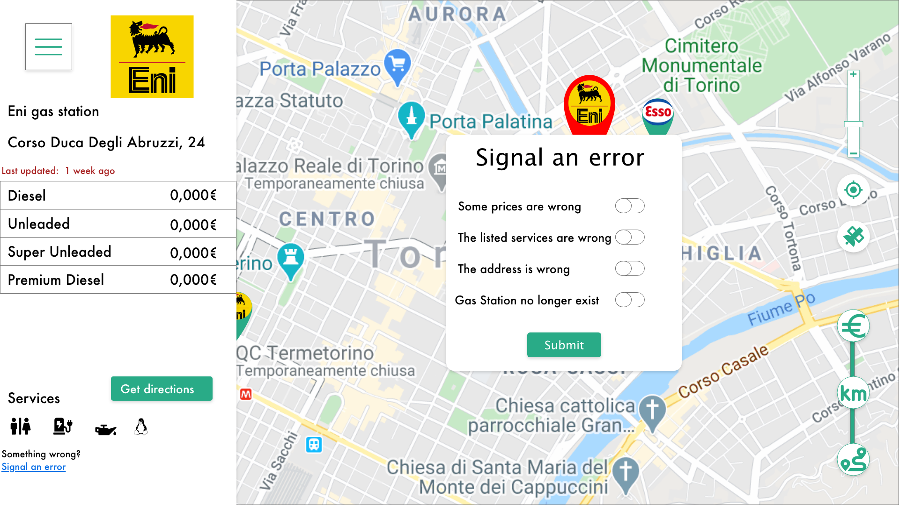

#UC9 and UC10:

- Delete an account
- Update profile

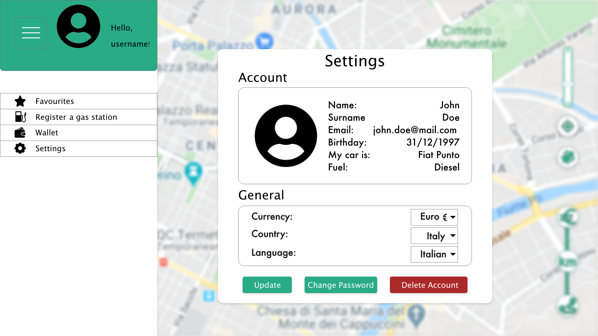

#UC11:

- Insert gas station in the favourite list

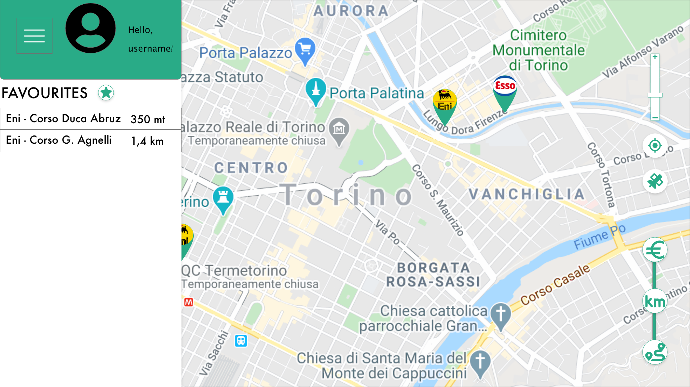

#UC12
- Every user can view the list of gas stations along a specific route

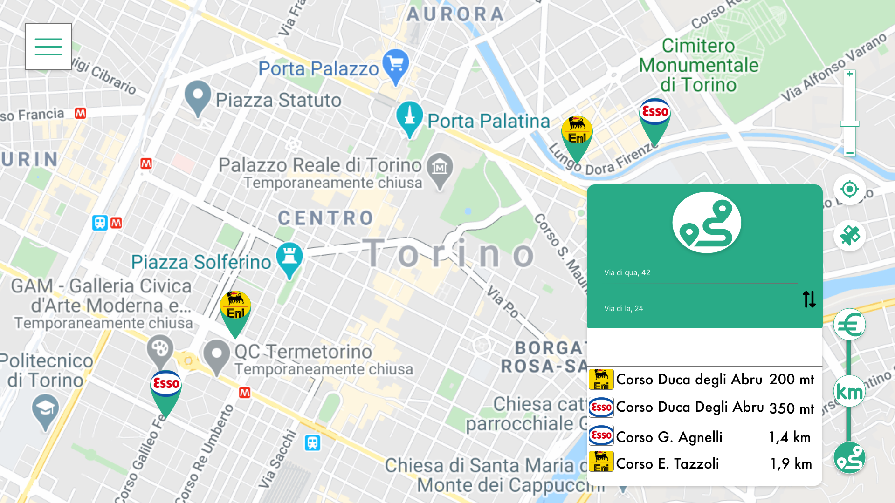

#FR2

- Every user can visualize information of a gas station

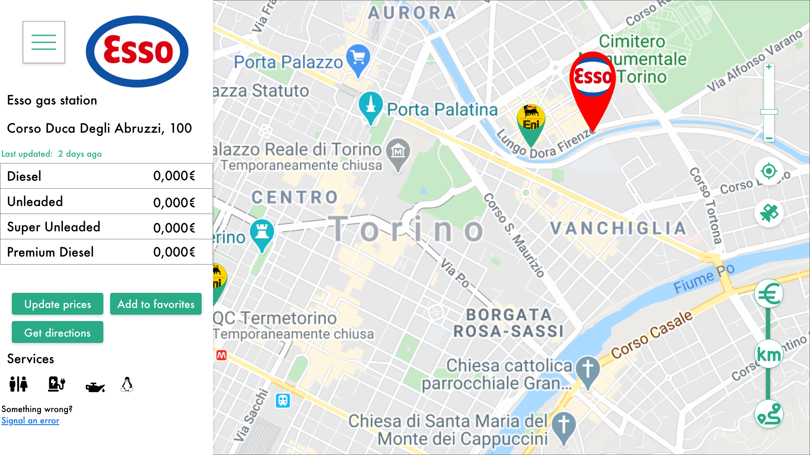

#FR3

- Every user can visualize the list of the closest gas stations

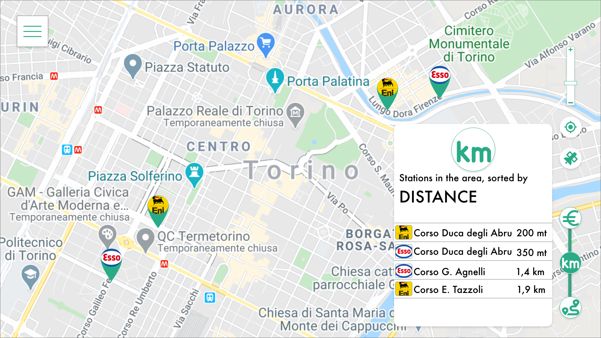

#FR5

- Every user can visualize the list of the cheapest gas stations

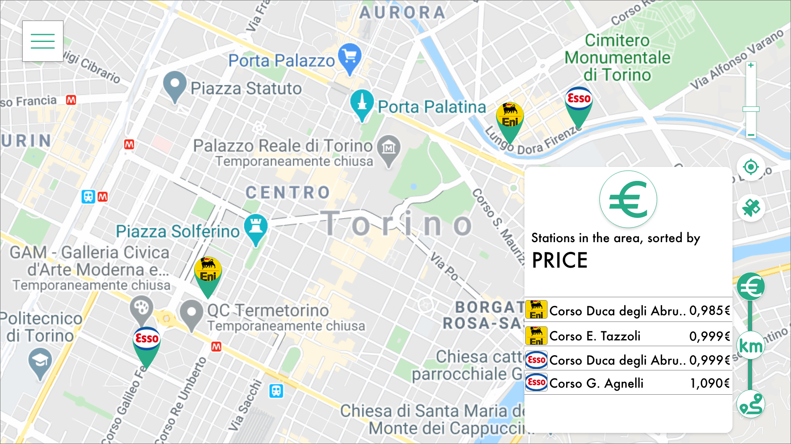

#FR11

- Registered user can see the points he collected and their equivalent money value in his wallet

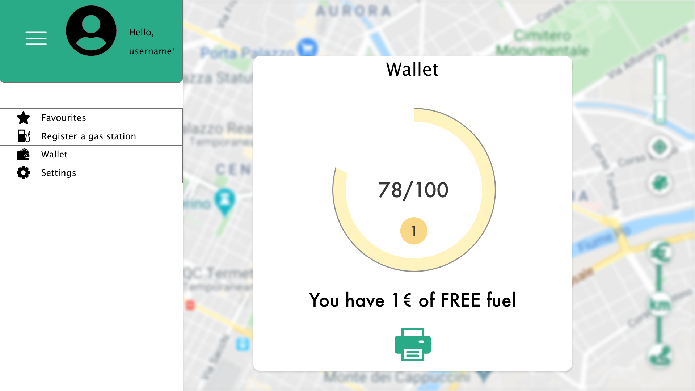

#FR12

- Registered user can print the coupon

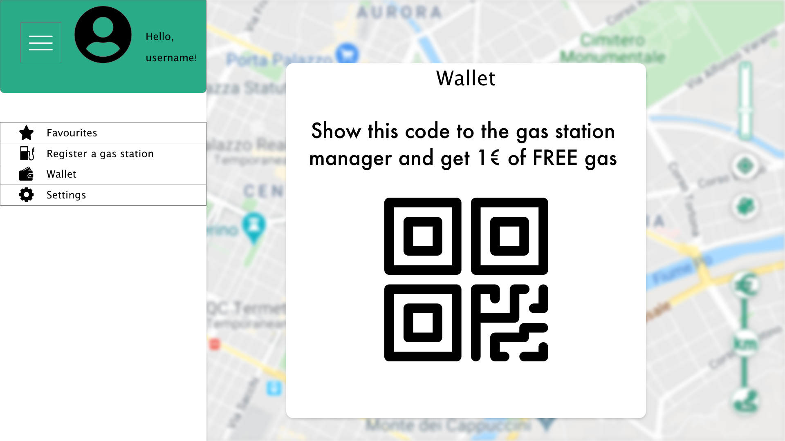