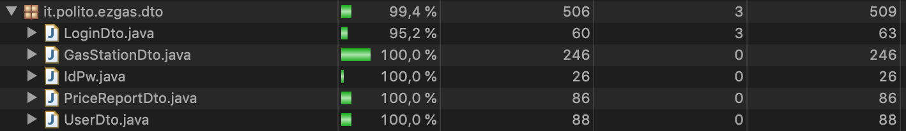

# Unit Testing Documentation

Authors: 
Barco Luca Di Vincenzo Alessandro Pappalardo Marco Giulio Lorenzo Petruzzi Rocco Luigi 

Date: 15/05/2020

Version:

# Contents

- [Black Box Unit Tests](#black-box-unit-tests)
    + [Class GasStation](#class-gasstation)
    + [Class User](#class-user)
    + [Class GasStationDto](#class-gasstationdto)
    + [Class UserDto](#class-userdto)
    + [Class LoginDto](#class-logindto)
    + [Class IdPw](#class-idpw)
    + [Class PriceReportDto](#class-pricereportdto)
- [White Box Unit Tests](#white-box-unit-tests)

# Black Box Unit Tests

 ## **Class *GasStation***

 ### **Class *GasStation* - method *setGasStationId***

**Criteria for method *setGasStationId*:**
	
 - Is an integer number
 - Range

**Predicates for method *setGasStationId*:**

| Criteria | Predicate |
| -------- | --------- |
|  Is an integer number        |     Yes      |
|          |      No     |
|  Range        |   >= Integer.MAX_VALUE   and <= Integer.MIN_VALUE   |
|          |     < Integer.MIN_VALUE      |
|          |     > Integer.MAX_VALUE      |

**Boundaries**:

| Criteria | Boundary values |
| -------- | --------------- |
|     Range     |     Integer.MIN_VALUE,Integer.MAX_VALUE        |
|          |                 |

**Combination of predicates**:

| Is an integer number | Boundary values | Valid / Invalid | Description of the test case | JUnit test case |
|-------|-------|-------|-------|-------|
|Yes    |>= Integer.MIN_VALUE   and <= Integer.MAX_VALUE| V |  setGasStationId(1250);|it.polito.ezgas.GasStationTests.TC1_GasStationId|
||||getgasStationId()-> 1250 ||
||< Integer.MIN_VALUE | I | setGasStationId(Integer.MIN_VALUE-1)|it.polito.ezgas.GasStationTests.TC2_GasStationId|
||||getgasStationId()-> Integer.MAX_VALUE ||
|| > Integer.MAX_VALUE| I | setGasStationId(Integer.MAX_VALUE+1)|it.polito.ezgas.GasStationTests.TC3_GasStationId|
||||getgasStationId()-> Integer.MIN_VALUE ||
|No    || I | Not feasible||

 ### **Class *GasStation* - method *setGasStationName***

**Criteria for method *setGasStationName*:**
	
 - String validity

**Predicates for method *setGasStationName*:**

| Criteria | Predicate |
| -------- | --------- |
|  String validity        |     Yes      |
|          |      No     |

**Boundaries**:

| Criteria | Boundary values |
| -------- | --------------- |
|          |                 |

**Combination of predicates**:

| String validity  | Valid / Invalid | Description of the test case | JUnit test case |
|-------|-------|-------|-------|
|Yes    | V |  setGasStationName("ENI Station 23");|it.polito.ezgas.GasStationTests.TC1_GasStationName|
||| getGasStationName() -> "ENI Station 23" ||
|No    | I | Not feasible||

 ### **Class *GasStation* - method *setGasStationAddress***

**Criteria for method *setGasStationAddress*:**

 - String validity

**Predicates for method *setGasStationAddress*:**

| Criteria | Predicate |
| -------- | --------- |
|  String validity        |     Yes      |
|          |      No     |

**Boundaries**:

| Criteria | Boundary values |
| -------- | --------------- |
|          |                 |

**Combination of predicates**:

| String validity  | Valid / Invalid | Description of the test case | JUnit test case |
|-------|-------|-------|-------|
|Yes    | V |  setGasStationAddress("Corso Duca 23"); |it.polito.ezgas.GasStationTests.TC1_GasStationAddress|
|||getGasStationAddress -> "Corso duca 23" ||
|No    | I | Not feasible||

### **Class *GasStation* - method *setReportDependability***

**Criteria for method *setReportDependability*:**

 - Is a double number
 - Range

**Predicates for method *setReportDependability*:**

| Criteria | Predicate |
| -------- | --------- |
|  Is a double number        |     Yes      |
|          |      No     |
|  Range        |   >= -(Double.MAX_VALUE)  and <= Double.MAX_VALUE   |
|          |     < (- Double.MAX_VALUE )     |
|          |     > Double.MAX_VALUE     |

**Boundaries**:

| Criteria | Boundary values |
| -------- | --------------- |
|     Range     |     -Double.MAX_VALUE,  Double.MAX_VALUE          |
|          |                 |

**Combination of predicates**:

| Is a double number | Boundary values | Valid / Invalid | Description of the test case | JUnit test case |
|-------|-------|-------|-------|-------|
|Yes    |>= (-Double.MAX_VALUE)   and <= Double.MAX_VALUE| V |  setReportDependability(12.45);|it.polito.ezgas.GasStationTests.TC1_GasStationReportDependability|
||||getReportDependability() -> 12.45 ||
||< (-Double.MAX_VALUE) | I | setReportDependability(-Double.MAX_VALUE-1)|it.polito.ezgas.GasStationTests.TC2_GasStationReportDependability|
||||getReportDependability() -> - Double.MAX_VALUE ||
|| > Double.MAX_VALUE| I | setReportDependability(Double.MAX_VALUE+1)|it.polito.ezgas.GasStationTests.TC3_GasStationReportDependability|
||||getReportDependability() -> Double.MAX_VAL ||
|No   | | I | Not feasible||

 ### **Class *GasStation* - method *setReportUser***

**Criteria for method *setReportUser*:**
	
 - Is an integer number
 - Range

**Predicates for method *setReportUser*:**

| Criteria | Predicate |
| -------- | --------- |
|  Is an integer number        |     Yes      |
|          |      No     |
|  Range        |   >= Integer.MAX_VALUE   and <= Integer.MIN_VALUE   |
|          |     < Integer.MIN_VALUE      |
|          |     > Integer.MAX_VALUE      |

**Boundaries**:

| Criteria | Boundary values |
| -------- | --------------- |
|     Range     |     Integer.MIN_VALUE, Integer.MAX_VALUE       |
|          |                 |

**Combination of predicates**:

| Is an integer number | Boundary values | Valid / Invalid | Description of the test case | JUnit test case |
|-------|-------|-------|-------|-------|
|Yes    |>= Integer.MIN_VALUE   and <= Integer.MAX_VALUE| V |  setReportUser(1250);|it.polito.ezgas.GasStationTests.TC1_GasStationReportUser|
||||getReportUser() -> 1250 ||
||< Integer.MIN_VALUE | I | setReportUser(Integer.MIN_VALUE-1) |it.polito.ezgas.GasStationTests.TC2_GasStationReportUser|
||||getReportUser() -> Integer.MAX_VALUE ||
|| > Integer.MAX_VALUE| I | setReportUser(Integer.MAX_VALUE+1)|it.polito.ezgas.GasStationTests.TC3_GasStationReportUser|
||||getReportUser() -> Integer.MIN_VALUE ||
|No    || I | Not feasible||

 ### **Class *GasStation* - method *setReportTimestamp***

**Criteria for method *setReportTimestamp*:**
	
 - String validity

**Predicates for method *setReportTimestamp*:**

| Criteria | Predicate |
| -------- | --------- |
|  String validity        |     Yes      |
|          |      No     |

**Boundaries**:

| Criteria | Boundary values |
| -------- | --------------- |
|          |                 |

**Combination of predicates**:

| String validity  | Valid / Invalid | Description of the test case | JUnit test case |
|-------|-------|-------|-------|
|Yes    | V |  setReportTimestamp("20200503T10:20:31");|it.polito.ezgas.GasStationTests.TC1_GasStationReportTimestamp|
||| getReportTimestamp() -> "20200503T10:20:31" ||:
|No    | I |Not feasible||

### **Class *GasStation* - method *setHasDiesel***

**Criteria for method *setHasDiesel*:**
	
 - Is a boolean

**Predicates for method *setHasDiesel*:**

| Criteria | Predicate |
| -------- | --------- |
|  Is a boolean       |     Yes      |
|          |      No     |

**Boundaries**:

| Criteria | Boundary values |
| -------- | --------------- |
|          |                 |

**Combination of predicates**:

| Is a boolean  | Valid / Invalid | Description of the test case | JUnit test case |
|-------|-------|-------|-------|
|Yes    | V |  setHasDiesel(true);|it.polito.ezgas.GasStationTests.TC1_GasStationHasDiesel|
||| getHasDiesel() -> true ||:
|No    | I | Not feasible||

### **Class *GasStation* - method *setHasSuper***

**Criteria for method *setHasSuper*:**
	
 - Is a boolean

**Predicates for method *setHasSuper*:**

| Criteria | Predicate |
| -------- | --------- |
|  Is a boolean       |     Yes      |
|          |      No     |

**Boundaries**:

| Criteria | Boundary values |
| -------- | --------------- |
|          |                 |

**Combination of predicates**:

| Is a boolean  | Valid / Invalid | Description of the test case | JUnit test case |
|-------|-------|-------|-------|
|Yes    | V |  setHasSuper(true);|it.polito.ezgas.GasStationTests.TC1_GasStationHasSuper|
||| getHasSuper() -> true ||:
|No    | I | Not feasible||

### **Class *GasStation* - method *setHasSuperPlus***

**Criteria for method *setHasSuperPlus*:**
	
 - Is a boolean

**Predicates for method *setHasSuperPlus*:**

| Criteria | Predicate |
| -------- | --------- |
|  Is a boolean       |     Yes      |
|          |      No     |

**Boundaries**:

| Criteria | Boundary values |
| -------- | --------------- |
|          |                 |

**Combination of predicates**:

| Is a boolean  | Valid / Invalid | Description of the test case | JUnit test case |
|-------|-------|-------|-------|
|Yes    | V |  setHasSuperPlus(true);|it.polito.ezgas.GasStationTests.TC1_GasStationHasSuperPlus|
||| getHasSuperPlus() -> true ||:
|No    | I |Not feasible||

### **Class *GasStation* - method *setHasGas***

**Criteria for method *setHasGas*:**

 - Is a boolean

**Predicates for method *setHasGas*:**

| Criteria | Predicate |
| -------- | --------- |
|  Is a boolean       |     Yes      |
|          |      No     |

**Boundaries**:

| Criteria | Boundary values |
| -------- | --------------- |
|          |                 |

**Combination of predicates**:

| Is a boolean  | Valid / Invalid | Description of the test case | JUnit test case |
|-------|-------|-------|-------|
|Yes    | V |  setHasGas(true);|it.polito.ezgas.GasStationTests.TC1_GasStationHasGas|
||| getHasGas() -> true ||:
|No    | I |Not feasible||

### **Class *GasStation* - method *setHasMethane***

**Criteria for method *setHasMethane*:**

 - Is a boolean

**Predicates for method *setHasMethane*:**

| Criteria | Predicate |
| -------- | --------- |
|  Is a boolean       |     Yes      |
|          |      No     |

**Boundaries**:

| Criteria | Boundary values |
| -------- | --------------- |
|          |                 |

**Combination of predicates**:

| Is a boolean  | Valid / Invalid | Description of the test case | JUnit test case |
|-------|-------|-------|-------|
|Yes    | V |  setHasMethane(true);|it.polito.ezgas.GasStationTests.TC1_GasStationHasMethane|
||| getHasMethane() -> true ||:
|No    | I | Not feasible||

### **Class *GasStation* - method *setHasPremiumDiesel***

**Criteria for method *setHasPremiumDiesel*:**

 - Is a boolean

**Predicates for method *setHasPremiumDiesel:**

| Criteria | Predicate |
| -------- | --------- |
|  Is a boolean       |     Yes      |
|          |      No     |

**Boundaries**:

| Criteria | Boundary values |
| -------- | --------------- |
|          |                 |

**Combination of predicates**:

| Is a boolean  | Valid / Invalid | Description of the test case | JUnit test case |
|-------|-------|-------|-------|
|Yes    | V |  setHasMethane(true);|it.polito.ezgas.GasStationTests.TC1_GasStationHasPremiumDiesel|
||| getHasPremiumDiesel() -> true ||:
|No    | I | Not feasible||

### **Class *GasStation* - method *setLat***

**Criteria for method *setLat*:**
	
 - Is a double number
 - Range

**Predicates for method *setLat*:**

| Criteria | Predicate |
| -------- | --------- |
|  Is a double number        |     Yes      |
|          |      No     |
|  Range        |   >= -(Double.MAX_VALUE)  and <= Double.MAX_VALUE   |
|          |     < (- Double.MAX_VALUE )     |
|          |     > Double.MAX_VALUE     |

**Boundaries**:

| Criteria | Boundary values |
| -------- | --------------- |
|     Range     |     -Double.MAX_VALUE,  Double.MAX_VALUE          |
|          |                 |

**Combination of predicates**:

| Is a double number | Boundary values | Valid / Invalid | Description of the test case | JUnit test case |
|-------|-------|-------|-------|-------|
|Yes    |>= (-Double.MAX_VALUE)  and <= Double.MAX_VALUE| V |  setLat(12.45);|it.polito.ezgas.GasStationTests.TC1_GasStationLat|
||||getLat() -> 12.45 ||
||< (-Double.MAX_VALUE) | I | setLat(-Double.MAX_VALUE-1) |it.polito.ezgas.GasStationTests.TC2_GasStationLat|
||||getLat() -> -Double.MAX_VALUE ||
|| > Double.MAX_VALUE| I | setLat(Double.MAX_VALUE+1) |it.polito.ezgas.GasStationTests.TC3_GasStationLat|
||||getLat() -> Double.MAX_VALUE ||
|No   || I | Not feasible||

### **Class *GasStation* - method *setLon***

**Criteria for method *setLon*:**

 - Is a double number
 - Range

**Predicates for method *setLon*:**

| Criteria | Predicate |
| -------- | --------- |
|  Is a double number        |     Yes      |
|          |      No     |
|  Range        |   >= -(Double.MAX_VALUE)  and <= Double.MAX_VALUE   |
|          |     < (- Double.MAX_VALUE )     |
|          |     > Double.MAX_VALUE     |

**Boundaries**:

| Criteria | Boundary values |
| -------- | --------------- |
|     Range     |     -Double.MAX_VALUE,  Double.MAX_VALUE          |
|          |                 |

**Combination of predicates**:

| Is a double number | Boundary values | Valid / Invalid | Description of the test case | JUnit test case |
|-------|-------|-------|-------|-------|
|Yes    |>= (-Double.MAX_VALUE)   and <= Double.MAX_VALUE| V |  setLon(12.45);|it.polito.ezgas.GasStationTests.TC1_GasStationLon|
||||getLon() -> 12.45 ||
||< (-Double.MAX_VALUE) | I | setLon(-Double.MAX_VALUE-1)|it.polito.ezgas.GasStationTests.TC2_GasStationLon|
||||getLon() -> - Double.MAX_VALUE ||
|| > Double.MAX_VALUE| I | setLon(Double.MAX_VALUE+1)|it.polito.ezgas.GasStationTests.TC3_GasStationLon|
||||getLon() -> Double.MAX_VALUE||
|No   | | I | Not feasible||

### **Class *GasStation* - method *setDieselPrice***

**Criteria for method *setDieselPrice*:**
	
 - Is a double number
 - Range

**Predicates for method *setDieselPrice*:**

| Criteria | Predicate |
| -------- | --------- |
|  Is a double number        |     Yes      |
|          |      No     |
|  Range        |   >= -(Double.MAX_VALUE)  and <= Double.MAX_VALUE   |
|          |     < (- Double.MAX_VALUE )     |
|          |     > Double.MAX_VALUE     |

**Boundaries**:

| Criteria | Boundary values |
| -------- | --------------- |
|     Range     |     -Double.MAX_VALUE,  Double.MAX_VALUE          |
|          |                 |

**Combination of predicates**:

| Is a double number | Boundary values | Valid / Invalid | Description of the test case | JUnit test case |
|-------|-------|-------|-------|-------|
|Yes    |>= (-Double.MAX_VALUE)   and <= Double.MAX_VALUE| V |  setDieselPrice(1.45);|it.polito.ezgas.GasStationTests.TC1_GasStationDieselPrice|
||||getDieselPrice() -> 1.45 ||
||< (-Double.MAX_VALUE) | I | setDieselPrice(-Double.MAX_VALUE-1) |it.polito.ezgas.GasStationTests.TC2_GasStationDieselPrice|
||||getDieselPrice() -> -Double.MAX_VALUE||
|| > Double.MAX_VALUE| I | setDieselPrice(Double.MAX_VALUE+1) |it.polito.ezgas.GasStationTests.TC3_GasStationDieselPrice|
||||getDieselPrice() -> Double.MAX_VALUE ||
|No   | | I | Not feasible||

### **Class *GasStation* - method *setSuperPrice***

**Criteria for method *setSuperPrice*:**
	
 - Is a double number
 - Range

**Predicates for method *setSuperPrice*:**

| Criteria | Predicate |
| -------- | --------- |
|  Is a double number        |     Yes      |
|          |      No     |
|  Range        |   >= -(Double.MAX_VALUE)  and <= Double.MAX_VALUE   |
|          |     < (- Double.MAX_VALUE )     |
|          |     > Double.MAX_VALUE     |

**Boundaries**:

| Criteria | Boundary values |
| -------- | --------------- |
|     Range     |     -Double.MAX_VALUE,  Double.MAX_VALUE          |
|          |                 |

**Combination of predicates**:

| Is a double number | Boundary values | Valid / Invalid | Description of the test case | JUnit test case |
|-------|-------|-------|-------|-------|
|Yes    |>= (-Double.MAX_VALUE)   and <= Double.MAX_VALUE| V |  setSuperPrice(1.45);|it.polito.ezgas.GasStationTests.TC1_GasStationSuperPrice|
||||getSuperPrice() -> 1.45 ||
||< (-Double.MAX_VALUE) | I | setSuperPrice(-Double.MAX_VALUE-1) |it.polito.ezgas.GasStationTests.TC2_GasStationSuperPrice|
||||getSuperPrice() -> -Double.MAX_VALUE ||
|| > Double.MAX_VALUE| I | setSuperPrice(Double.MAX_VALUE+1) |it.polito.ezgas.GasStationTests.TC3_GasStationSuperPrice|
||||getSuperPrice() -> Double.MAX_VALUE ||
|No   | | I | Not feasible||

### **Class *GasStation* - method *setSuperPlusPrice***

**Criteria for method *setSuperPlusPrice*:**
	
 - Is a double number
 - Range

**Predicates for method *setSuperPlusPrice*:**

| Criteria | Predicate |
| -------- | --------- |
|  Is a double number        |     Yes      |
|          |      No     |
|  Range        |   >= -(Double.MAX_VALUE)  and <= Double.MAX_VALUE   |
|          |     < (- Double.MAX_VALUE )     |
|          |     > Double.MAX_VALUE     |

**Boundaries**:

| Criteria | Boundary values |
| -------- | --------------- |
|     Range     |     -Double.MAX_VALUE,  Double.MAX_VALUE          |
|          |                 |

**Combination of predicates**:

| Is a double number | Boundary values | Valid / Invalid | Description of the test case | JUnit test case |
|-------|-------|-------|-------|-------|
|Yes    |>= (-Double.MAX_VALUE)   and <= Double.MAX_VALUE| V |  setSuperPlusPrice(1.45);|it.polito.ezgas.GasStationTests.TC1_GasStationSuperPlusPrice|
||||getSuperPlusPrice() -> 1.45 ||
||< (-Double.MAX_VALUE) | I | setSuperPlusPrice(-Double.MAX_VALUE-1) |it.polito.ezgas.GasStationTests.TC2_GasStationSuperPlusPrice|
||||getSuperPlusPrice() -> -Double.MAX_VALUE ||
|| > Double.MAX_VALUE| I | setSuperPlusPrice(Double.MAX_VALUE+1) |it.polito.ezgas.GasStationTests.TC3_GasStationSuperPlusPrice|
||||getSuperPlusPrice() -> Double.MAX_VALUE ||
|No   | | I | Not feasible||

### **Class *GasStation* - method *setGasPrice***

**Criteria for method *setGasPrice*:**
	
 - Is a double number
 - Range

**Predicates for method *setGasPrice*:**

| Criteria | Predicate |
| -------- | --------- |
|  Is a double number        |     Yes      |
|          |      No     |
|  Range        |   >= -(Double.MAX_VALUE)  and <= Double.MAX_VALUE   |
|          |     < (- Double.MAX_VALUE )     |
|          |     > Double.MAX_VALUE     |

**Boundaries**:

| Criteria | Boundary values |
| -------- | --------------- |
|     Range     |     -Double.MAX_VALUE,  Double.MAX_VALUE          |
|          |                 |

**Combination of predicates**:

| Is a double number | Boundary values | Valid / Invalid | Description of the test case | JUnit test case |
|-------|-------|-------|-------|-------|
|Yes    |>= (-Double.MAX_VALUE)   and <= Double.MAX_VALUE| V |  setGasPrice(1.45);|it.polito.ezgas.GasStationTests.TC1_GasStationGasPrice|
||||getGasPrice() -> 1.45 ||
||< (-Double.MAX_VALUE) | I | setGasPrice(-Double.MAX_VALUE-1) |it.polito.ezgas.GasStationTests.TC2_GasStationGasPrice|
||||getGasPrice() -> Double.MAX_VALUE ||
|| > Double.MAX_VALUE| I | setGasPrice(Double.MAX_VALUE+1) |it.polito.ezgas.GasStationTests.TC3_GasStationGasPrice|
||||getGasPrice() -> Double.MAX_VALUE ||
|No   || I | Not feasible||

### **Class *GasStation* - method *setMethanePrice***

**Criteria for method *setMethanePrice*:**

 - Is a double number
 - Range

**Predicates for method *setMethanePrice*:**

| Criteria | Predicate |
| -------- | --------- |
|  Is a double number        |     Yes      |
|          |      No     |
|  Range        |   >= -(Double.MAX_VALUE)  and <= Double.MAX_VALUE   |
|          |     < (- Double.MAX_VALUE )     |
|          |     > Double.MAX_VALUE     |

**Boundaries**:

| Criteria | Boundary values |
| -------- | --------------- |
|     Range     |     -Double.MAX_VALUE,  Double.MAX_VALUE          |
|          |                 |

**Combination of predicates**:

| Is a double number | Boundary values | Valid / Invalid | Description of the test case | JUnit test case |
|-------|-------|-------|-------|-------|
|Yes    |>= (-Double.MAX_VALUE)   and <= Double.MAX_VALUE| V |  setMethanePrice(1.45);|it.polito.ezgas.GasStationTests.TC1_GasStationMethanePrice|
||||getMethanePrice() -> 1.45 ||
||< (-Double.MAX_VALUE) | I | setMethanePrice(-Double.MAX_VALUE-1) |it.polito.ezgas.GasStationTests.TC2_GasStationMethanePrice|
||||getMethanePrice() -> -Double.MAX_VALUE ||
|| > Double.MAX_VALUE| I | setMethanePrice(Double.MAX_VALUE+1) |it.polito.ezgas.GasStationTests.TC3_GasStationMethanePrice|
||||getMethanePrice() -> Double.MAX_VALUE ||
|No   || I | Not feasible||

### **Class *GasStation* - method *setPremiumDieselPrice***

**Criteria for method *setPremiumDieselPrice*:**
	
 - Is a double number
 - Range

**Predicates for method *setPremiumDieselPrice*:**

| Criteria | Predicate |
| -------- | --------- |
|  Is a double number        |     Yes      |
|          |      No     |
|  Range        |   >= -(Double.MAX_VALUE)  and <= Double.MAX_VALUE   |
|          |     < (- Double.MAX_VALUE )     |
|          |     > Double.MAX_VALUE     |

**Boundaries**:

| Criteria | Boundary values |
| -------- | --------------- |
|     Range     |     -Double.MAX_VALUE,  Double.MAX_VALUE          |
|          |                 |

**Combination of predicates**:

| Is a double number | Boundary values | Valid / Invalid | Description of the test case | JUnit test case |
|-------|-------|-------|-------|-------|
|Yes    |>= (-Double.MAX_VALUE)   and <= Double.MAX_VALUE| V |  setPremiumDieselPrice(1.45);|it.polito.ezgas.GasStationDtoTests.TC1_GasStationPremiumDieselPrice|
||||getPremiumDieselPrice() -> 1.45 ||
||< (-Double.MAX_VALUE) | I | setPremiumDieselPrice(-Double.MAX_VALUE-1) |it.polito.ezgas.GasStationDtoTests.TC2_GasStationPremiumDieselPrice|
||||getPremiumDieselPrice() -> -Double.MAX_VALUE||
|| > Double.MAX_VALUE| I | setPremiumDieselPrice(Double.MAX_VALUE+1) |it.polito.ezgas.GasStationDtoTests.TC3_GasStationPremiumDieselPrice|
||||getPremiumDieselPrice() -> Double.MAX_VALUE ||
|No   | | I | Not feasible||

 ### **Class *GasStation* - method *setCarSharing***

**Criteria for method *setCarSharing*:**
	
 - String validity

**Predicates for method *setCarSharing*:**

| Criteria | Predicate |
| -------- | --------- |
|  String validity        |     Yes      |
|          |      No     |

**Boundaries**:

| Criteria | Boundary values |
| -------- | --------------- |
|          |                 |

**Combination of predicates**:

| String validity  | Valid / Invalid | Description of the test case | JUnit test case |
|-------|-------|-------|-------|
|Yes    | V |  setCarSharing("Enjoy");|it.polito.ezgas.GasStationTests.TC1_GasStationCarSharing|
||| getCarSharing() -> "Enjoy" ||:
|No    | I | Not feasible||

 ### **Class *GasStation* - method *setUser***

**Criteria for method *setUser*:**

 - User validity

**Predicates for method *setUser*:**

| Criteria | Predicate |
| -------- | --------- |
|  User validity        |     Yes      |
|          |      No     |

**Boundaries**:

| Criteria | Boundary values |
| -------- | --------------- |
|          |                 |
|          |                 |

**Combination of predicates**:

| String validity  | Valid / Invalid | Description of the test case | JUnit test case |
|-------|-------|-------|-------|
|Yes    | V |  setUser(user1);|it.polito.ezgas.GasStationTests.TC1_GasStationUser|
||| getUser() -> user1 ||:
|No    | I | Not feasible||

 ## **Class *User***

 ### **Class *User* - method *setUserId***

**Criteria for method *setUserId*:**
	
 - Is an integer number
 - Range

**Predicates for method *setUserId*:**

| Criteria | Predicate |
| -------- | --------- |
|  Is an integer number        |     Yes      |
|          |      No     |
|  Range        |   >= Integer.MAX_VALUE   and <= Integer.MIN_VALUE   |
|          |     < Integer.MIN_VALUE      |
|          |     > Integer.MAX_VALUE      |

**Boundaries**:

| Criteria | Boundary values |
| -------- | --------------- |
|     Range     |     Integer.MIN_VALUE, Integer.MAX_VALUE       |
|          |                 |

**Combination of predicates**:

| Is an integer number | Boundary values | Valid / Invalid | Description of the test case | JUnit test case |
|-------|-------|-------|-------|-------|
|Yes    |>= Integer.MIN_VALUE   and <= Integer.MAX_VALUE| V |  setUserId(8888);|it.polito.ezgas.UserTests.TC1_UserID|
||||getUserId()-> 8888 ||
||< Integer.MIN_VALUE | I | setUserId(Integer.MIN_VALUE-1) |it.polito.ezgas.UserTests.TC2_UserID|
||||getUserId()-> Integer.MAX_VALUE ||
|| > Integer.MAX_VALUE| I | setUserId(Integer.MAX_VALUE+1)|it.polito.ezgas.UserTests.TC3_UserID|
||||getUserId()-> Integer.MIN_VALUE ||
|No    || I | Not feasible||

 ### **Class *User* - method *setUserName***

**Criteria for method *setUserName*:**
	
 - String validity

**Predicates for method *setUserName*:**

| Criteria | Predicate |
| -------- | --------- |
|  String validity        |     Yes      |
|          |      No     |

**Boundaries**:

| Criteria | Boundary values |
| -------- | --------------- |
|          |                 |

**Combination of predicates**:

| String validity  | Valid / Invalid | Description of the test case | JUnit test case |
|-------|-------|-------|-------|
|Yes    | V |  setUserName("Enrico Mattei");|it.polito.ezgas.UserTests.TC1_UserName|
||| getUserName() -> "Enrico Mattei" ||
|No    | I | Not feasible||

 ### **Class *User* - method *setPassword***

**Criteria for method *setPassword*:**

 - String validity

**Predicates for method *setPassword*:**

| Criteria | Predicate |
| -------- | --------- |
|  String validity        |     Yes      |
|          |      No     |

**Boundaries**:

| Criteria | Boundary values |
| -------- | --------------- |
|          |                 |

**Combination of predicates**:

| String validity  | Valid / Invalid | Description of the test case | JUnit test case |
|-------|-------|-------|-------|
|Yes    | V |  setPassword("Th1s@ppISc00l"); |it.polito.ezgas.UserTests.TC1_UserPassword|
|||getPassword -> "Th1s@ppISc00l" ||
|No    | I | Not feasible||

### **Class *User* - method *setEmail***

**Criteria for method *setEmail*:**
	
 - String validity

**Predicates for method *setEmail*:**

| Criteria | Predicate |
| -------- | --------- |
|   String validity     |     Yes      |
|          |      No     |

**Boundaries**:

| Criteria | Boundary values |
| -------- | --------------- |
|          |                 |

**Combination of predicates**:

| String validity  | Valid / Invalid | Description of the test case | JUnit test case |
|-------|-------|-------|-------|
|Yes    | V |  setEmail("enrico.mattei@eni.it"); |it.polito.ezgas.UserTests.TC1_UserEmail|
|||getEmail -> "enrico.mattei@eni.it" ||
|No    | I | Not feasible||

 ### **Class *User* - method *setReputation***

**Criteria for method *setReputation*:**
	
 - Is an integer number
 - Range

**Predicates for method *setReputation*:**

| Criteria | Predicate |
| -------- | --------- |
|  Is an integer number        |     Yes      |
|          |      No     |
|  Range        |   >= Integer.MAX_VALUE   and <= Integer.MIN_VALUE   |
|          |     < Integer.MIN_VALUE      |
|          |     > Integer.MAX_VALUE      |

**Boundaries**:

| Criteria | Boundary values |
| -------- | --------------- |
|     Range     |     Integer.MIN_VALUE, Integer.MAX_VALUE       |
|          |                 |

**Combination of predicates**:

| Is an integer number | Boundary values | Valid / Invalid | Description of the test case | JUnit test case |
|-------|-------|-------|-------|-------|
|Yes    |>= Integer.MIN_VALUE   and <= Integer.MAX_VALUE| V |  setReputation(100);|it.polito.ezgas.UserTests.TC1_UserReputation|
||||getReputation() -> 100 ||
||< Integer.MIN_VALUE | I | setReputation(Integer.MIN_VALUE-1)|it.polito.ezgas.UserTests.TC2_UserReputation|
||||getReputation() -> Integer.MAX_VALUE ||
|| > Integer.MAX_VALUE| I | setReputation(Integer.MAX_VALUE+1)|it.polito.ezgas.UserTests.TC3_UserReputation|
||||getReputation() -> Integer.MIN_VALUE ||
|No    || I | Not feasible||

### **Class *User* - method *setAdmin***

**Criteria for method *setAdmin*:**

 - Is a boolean

**Predicates for method *setAdmin*:**

| Criteria | Predicate |
| -------- | --------- |
|  Is a boolean       |     Yes      |
|          |      No     |

**Boundaries**:

| Criteria | Boundary values |
| -------- | --------------- |
|          |                 |

**Combination of predicates**:

| Is a boolean  | Valid / Invalid | Description of the test case | JUnit test case |
|-------|-------|-------|-------|
|Yes    | V |  setAdmin(true);|it.polito.ezgas.UserTests.TC1_UserAdmin|
||| getAdmin() -> false ||:
|No    | I | Not feasible||

 ## **Class *GasStationDto***

 ### **Class *GasStationDto* - method *setGasStationId***

**Criteria for method *setGasStationId*:**
	
 - Is an integer number
 - Range

**Predicates for method *setGasStationId*:**

| Criteria | Predicate |
| -------- | --------- |
|  Is an integer number        |     Yes      |
|          |      No     |
|  Range        |   >= Integer.MAX_VALUE   and <= Integer.MIN_VALUE   |
|          |     < Integer.MIN_VALUE      |
|          |     > Integer.MAX_VALUE      |

**Boundaries**:

| Criteria | Boundary values |
| -------- | --------------- |
|     Range     |     Integer.MIN_VALUE,Integer.MAX_VALUE        |
|          |                 |

**Combination of predicates**:

| Is an integer number | Boundary values | Valid / Invalid | Description of the test case | JUnit test case |
|-------|-------|-------|-------|-------|
|Yes    |>= Integer.MIN_VALUE   and <= Integer.MAX_VALUE| V |  setGasStationId(1250);|it.polito.ezgas.GasStationDtoTests.TC1_GasStationId|
||||getgasStationId()-> 1250 ||
||< Integer.MIN_VALUE | I | setGasStationId(Integer.MIN_VALUE-1)|it.polito.ezgas.GasStationDtoTests.TC2_GasStationId|
||||getgasStationId()-> Integer.MAX_VALUE ||
|| > Integer.MAX_VALUE| I | setGasStationId(Integer.MAX_VALUE+1)|it.polito.ezgas.GasStationDtoTests.TC3_GasStationId|
||||getgasStationId()-> Integer.MIN_VALUE ||
|No    || I | Not feasible||

 ### **Class *GasStationDto* - method *setGasStationName***

**Criteria for method *setGasStationName*:**
	
 - String validity

**Predicates for method *setGasStationName*:**

| Criteria | Predicate |
| -------- | --------- |
|  String validity        |     Yes      |
|          |      No     |

**Boundaries**:

| Criteria | Boundary values |
| -------- | --------------- |
|          |                 |

**Combination of predicates**:

| String validity  | Valid / Invalid | Description of the test case | JUnit test case |
|-------|-------|-------|-------|
|Yes    | V |  setGasStationName("ENI Station 23");|it.polito.ezgas.GasStationDtoTests.TC1_GasStationName|
||| getGasStationName() -> "ENI Station 23" ||
|No    | I | Not feasible||

 ### **Class *GasStationDto* - method *setGasStationAddress***

**Criteria for method *setGasStationAddress*:**

 - String validity

**Predicates for method *setGasStationAddress*:**

| Criteria | Predicate |
| -------- | --------- |
|  String validity        |     Yes      |
|          |      No     |

**Boundaries**:

| Criteria | Boundary values |
| -------- | --------------- |
|          |                 |

**Combination of predicates**:

| String validity  | Valid / Invalid | Description of the test case | JUnit test case |
|-------|-------|-------|-------|
|Yes    | V |  setGasStationAddress("Corso Duca 23"); |it.polito.ezgas.GasStationDtoTests.TC1_GasStationAddress|
|||getGasStationAddress -> "Corso duca 23" ||
|No    | I | Not feasible||

### **Class *GasStationDto* - method *setReportDependability***

**Criteria for method *setReportDependability*:**

 - Is a double number
 - Range

**Predicates for method *setReportDependability*:**

| Criteria | Predicate |
| -------- | --------- |
|  Is a double number        |     Yes      |
|          |      No     |
|  Range        |   >= -(Double.MAX_VALUE)  and <= Double.MAX_VALUE   |
|          |     < (- Double.MAX_VALUE )     |
|          |     > Double.MAX_VALUE     |

**Boundaries**:

| Criteria | Boundary values |
| -------- | --------------- |
|     Range     |     -Double.MAX_VALUE,  Double.MAX_VALUE          |
|          |                 |

**Combination of predicates**:

| Is a double number | Boundary values | Valid / Invalid | Description of the test case | JUnit test case |
|-------|-------|-------|-------|-------|
|Yes    |>= (-Double.MAX_VALUE)   and <= Double.MAX_VALUE| V |  setReportDependability(12.45);|it.polito.ezgas.GasStationDtoTests.TC1_GasStationReportDependability|
||||getReportDependability() -> 12.45 ||
||< (-Double.MAX_VALUE) | I | setReportDependability(-Double.MAX_VALUE-1)|it.polito.ezgas.GasStationDtoTests.TC2_GasStationReportDependability|
||||getReportDependability() -> - Double.MAX_VALUE ||
|| > Double.MAX_VALUE| I | setReportDependability(Double.MAX_VALUE+1)|it.polito.ezgas.GasStationDtoTests.TC3_GasStationReportDependability|
||||getReportDependability() -> Double.MAX_VAL ||
|No   | | I | Not feasible||

 ### **Class *GasStationDto* - method *setReportUser***

**Criteria for method *setReportUser*:**
	
 - Is an integer number
 - Range

**Predicates for method *setReportUser*:**

| Criteria | Predicate |
| -------- | --------- |
|  Is an integer number        |     Yes      |
|          |      No     |
|  Range        |   >= Integer.MAX_VALUE   and <= Integer.MIN_VALUE   |
|          |     < Integer.MIN_VALUE      |
|          |     > Integer.MAX_VALUE      |

**Boundaries**:

| Criteria | Boundary values |
| -------- | --------------- |
|     Range     |     Integer.MIN_VALUE, Integer.MAX_VALUE       |
|          |                 |

**Combination of predicates**:

| Is an integer number | Boundary values | Valid / Invalid | Description of the test case | JUnit test case |
|-------|-------|-------|-------|-------|
|Yes    |>= Integer.MIN_VALUE   and <= Integer.MAX_VALUE| V |  setReportUser(1250);|it.polito.ezgas.GasStationDtoTests.TC1_GasStationReportUser|
||||getReportUser() -> 1250 ||
||< Integer.MIN_VALUE | I | setReportUser(Integer.MIN_VALUE-1) |it.polito.ezgas.GasStationDtoTests.TC2_GasStationReportUser|
||||getReportUser() -> Integer.MAX_VALUE ||
|| > Integer.MAX_VALUE| I | setReportUser(Integer.MAX_VALUE+1)|it.polito.ezgas.GasStationDtoTests.TC3_GasStationReportUser|
||||getReportUser() -> Integer.MIN_VALUE ||
|No    || I | Not feasible||

 ### **Class *GasStationDto* - method *setReportTimestamp***

**Criteria for method *setReportTimestamp*:**
	
 - String validity

**Predicates for method *setReportTimestamp*:**

| Criteria | Predicate |
| -------- | --------- |
|  String validity        |     Yes      |
|          |      No     |

**Boundaries**:

| Criteria | Boundary values |
| -------- | --------------- |
|          |                 |

**Combination of predicates**:

| String validity  | Valid / Invalid | Description of the test case | JUnit test case |
|-------|-------|-------|-------|
|Yes    | V |  setReportTimestamp("20200503T10:20:31");|it.polito.ezgas.GasStationDtoTests.TC1_GasStationReportTimestamp|
||| getReportTimestamp() -> "20200503T10:20:31" ||:
|No    | I |Not feasible||

### **Class *GasStationDto* - method *setHasDiesel***

**Criteria for method *setHasDiesel*:**
	
 - Is a boolean

**Predicates for method *setHasDiesel*:**

| Criteria | Predicate |
| -------- | --------- |
|  Is a boolean       |     Yes      |
|          |      No     |

**Boundaries**:

| Criteria | Boundary values |
| -------- | --------------- |
|          |                 |

**Combination of predicates**:

| Is a boolean  | Valid / Invalid | Description of the test case | JUnit test case |
|-------|-------|-------|-------|
|Yes    | V |  setHasDiesel(true);|it.polito.ezgas.GasStationDtoTests.TC1_GasStationHasDiesel|
||| getHasDiesel() -> true ||:
|No    | I | Not feasible||

### **Class *GasStationDto* - method *setHasSuper***

**Criteria for method *setHasSuper*:**
	
 - Is a boolean

**Predicates for method *setHasSuper*:**

| Criteria | Predicate |
| -------- | --------- |
|  Is a boolean       |     Yes      |
|          |      No     |

**Boundaries**:

| Criteria | Boundary values |
| -------- | --------------- |
|          |                 |

**Combination of predicates**:

| Is a boolean  | Valid / Invalid | Description of the test case | JUnit test case |
|-------|-------|-------|-------|
|Yes    | V |  setHasSuper(true);|it.polito.ezgas.GasStationDtoTests.TC1_GasStationHasSuper|
||| getHasSuper() -> true ||:
|No    | I | Not feasible||

### **Class *GasStationDto* - method *setHasSuperPlus***

**Criteria for method *setHasSuperPlus*:**
	
 - Is a boolean

**Predicates for method *setHasSuperPlus*:**

| Criteria | Predicate |
| -------- | --------- |
|  Is a boolean       |     Yes      |
|          |      No     |

**Boundaries**:

| Criteria | Boundary values |
| -------- | --------------- |
|          |                 |

**Combination of predicates**:

| Is a boolean  | Valid / Invalid | Description of the test case | JUnit test case |
|-------|-------|-------|-------|
|Yes    | V |  setHasSuperPlus(true);|it.polito.ezgas.GasStationDtoTests.TC1_GasStationHasSuperPlus|
||| getHasSuperPlus() -> true ||:
|No    | I |Not feasible||

### **Class *GasStationDto* - method *setHasGas***

**Criteria for method *setHasGas*:**

 - Is a boolean

**Predicates for method *setHasGas*:**

| Criteria | Predicate |
| -------- | --------- |
|  Is a boolean       |     Yes      |
|          |      No     |

**Boundaries**:

| Criteria | Boundary values |
| -------- | --------------- |
|          |                 |

**Combination of predicates**:

| Is a boolean  | Valid / Invalid | Description of the test case | JUnit test case |
|-------|-------|-------|-------|
|Yes    | V |  setHasGas(true);|it.polito.ezgas.GasStationDtoTests.TC1_GasStationHasGas|
||| getHasGas() -> true ||:
|No    | I |Not feasible||

### **Class *GasStationDto* - method *setHasMethane***

**Criteria for method *setHasMethane*:**

 - Is a boolean

**Predicates for method *setHasMethane*:**

| Criteria | Predicate |
| -------- | --------- |
|  Is a boolean       |     Yes      |
|          |      No     |

**Boundaries**:

| Criteria | Boundary values |
| -------- | --------------- |
|          |                 |

**Combination of predicates**:

| Is a boolean  | Valid / Invalid | Description of the test case | JUnit test case |
|-------|-------|-------|-------|
|Yes    | V |  setHasMethane(true);|it.polito.ezgas.GasStationDtoTests.TC1_GasStationHasMethane|
||| getHasMethane() -> true ||:
|No    | I | Not feasible||

### **Class *GasStationDto* - method *setHasPremiumDiesel***

**Criteria for method *setHasPremiumDiesel*:**

 - Is a boolean

**Predicates for method *setHasPremiumDiesel:**

| Criteria | Predicate |
| -------- | --------- |
|  Is a boolean       |     Yes      |
|          |      No     |

**Boundaries**:

| Criteria | Boundary values |
| -------- | --------------- |
|          |                 |

**Combination of predicates**:

| Is a boolean  | Valid / Invalid | Description of the test case | JUnit test case |
|-------|-------|-------|-------|
|Yes    | V |  setHasMethane(true);|it.polito.ezgas.GasStationTests.TC1_GasStationHasPremiumDiesel|
||| getHasPremiumDiesel() -> true ||:
|No    | I | Not feasible||

### **Class *GasStationDto* - method *setLat***

**Criteria for method *setLat*:**
	
 - Is a double number
 - Range

**Predicates for method *setLat*:**

| Criteria | Predicate |
| -------- | --------- |
|  Is a double number        |     Yes      |
|          |      No     |
|  Range        |   >= -(Double.MAX_VALUE)  and <= Double.MAX_VALUE   |
|          |     < (- Double.MAX_VALUE )     |
|          |     > Double.MAX_VALUE     |

**Boundaries**:

| Criteria | Boundary values |
| -------- | --------------- |
|     Range     |     -Double.MAX_VALUE,  Double.MAX_VALUE          |
|          |                 |

**Combination of predicates**:

| Is a double number | Boundary values | Valid / Invalid | Description of the test case | JUnit test case |
|-------|-------|-------|-------|-------|
|Yes    |>= (-Double.MAX_VALUE)  and <= Double.MAX_VALUE| V |  setLat(12.45);|it.polito.ezgas.GasStationDtoTests.TC1_GasStationLat|
||||getLat() -> 12.45 ||
||< (-Double.MAX_VALUE) | I | setLat(-Double.MAX_VALUE-1) |it.polito.ezgas.GasStationDtoTests.TC2_GasStationLat|
||||getLat() -> -Double.MAX_VALUE ||
|| > Double.MAX_VALUE| I | setLat(Double.MAX_VALUE+1) |it.polito.ezgas.GasStationDtoTests.TC3_GasStationLat|
||||getLat() -> Double.MAX_VALUE ||
|No   || I | Not feasible||

### **Class *GasStationDto* - method *setLon***

**Criteria for method *setLon*:**

 - Is a double number
 - Range

**Predicates for method *setLon*:**

| Criteria | Predicate |
| -------- | --------- |
|  Is a double number        |     Yes      |
|          |      No     |
|  Range        |   >= -(Double.MAX_VALUE)  and <= Double.MAX_VALUE   |
|          |     < (- Double.MAX_VALUE )     |
|          |     > Double.MAX_VALUE     |

**Boundaries**:

| Criteria | Boundary values |
| -------- | --------------- |
|     Range     |     -Double.MAX_VALUE,  Double.MAX_VALUE          |
|          |                 |

**Combination of predicates**:

| Is a double number | Boundary values | Valid / Invalid | Description of the test case | JUnit test case |
|-------|-------|-------|-------|-------|
|Yes    |>= (-Double.MAX_VALUE)   and <= Double.MAX_VALUE| V |  setLon(12.45);|it.polito.ezgas.GasStationDtoTests.TC1_GasStationLon|
||||getLon() -> 12.45 ||
||< (-Double.MAX_VALUE) | I | setLon(-Double.MAX_VALUE-1)|it.polito.ezgas.GasStationDtoTests.TC2_GasStationLon|
||||getLon() -> - Double.MAX_VALUE ||
|| > Double.MAX_VALUE| I | setLon(Double.MAX_VALUE+1)|it.polito.ezgas.GasStationDtoTests.TC3_GasStationLon|
||||getLon() -> Double.MAX_VALUE||
|No   | | I | Not feasible||

### **Class *GasStationDto* - method *setDieselPrice***

**Criteria for method *setDieselPrice*:**
	
 - Is a double number
 - Range

**Predicates for method *setDieselPrice*:**

| Criteria | Predicate |
| -------- | --------- |
|  Is a double number        |     Yes      |
|          |      No     |
|  Range        |   >= -(Double.MAX_VALUE)  and <= Double.MAX_VALUE   |
|          |     < (- Double.MAX_VALUE )     |
|          |     > Double.MAX_VALUE     |

**Boundaries**:

| Criteria | Boundary values |
| -------- | --------------- |
|     Range     |     -Double.MAX_VALUE,  Double.MAX_VALUE          |
|          |                 |

**Combination of predicates**:

| Is a double number | Boundary values | Valid / Invalid | Description of the test case | JUnit test case |
|-------|-------|-------|-------|-------|
|Yes    |>= (-Double.MAX_VALUE)   and <= Double.MAX_VALUE| V |  setDieselPrice(1.45);|it.polito.ezgas.GasStationDtoTests.TC1_GasStationDieselPrice|
||||getDieselPrice() -> 1.45 ||
||< (-Double.MAX_VALUE) | I | setDieselPrice(-Double.MAX_VALUE-1) |it.polito.ezgas.GasStationDtoTests.TC2_GasStationDieselPrice|
||||getDieselPrice() -> -Double.MAX_VALUE||
|| > Double.MAX_VALUE| I | setDieselPrice(Double.MAX_VALUE+1) |it.polito.ezgas.GasStationDtoTests.TC3_GasStationDieselPrice|
||||getDieselPrice() -> Double.MAX_VALUE ||
|No   | | I | Not feasible||

### **Class *GasStationDto* - method *setSuperPrice***

**Criteria for method *setSuperPrice*:**
	
 - Is a double number
 - Range

**Predicates for method *setSuperPrice*:**

| Criteria | Predicate |
| -------- | --------- |
|  Is a double number        |     Yes      |
|          |      No     |
|  Range        |   >= -(Double.MAX_VALUE)  and <= Double.MAX_VALUE   |
|          |     < (- Double.MAX_VALUE )     |
|          |     > Double.MAX_VALUE     |

**Boundaries**:

| Criteria | Boundary values |
| -------- | --------------- |
|     Range     |     -Double.MAX_VALUE,  Double.MAX_VALUE          |
|          |                 |

**Combination of predicates**:

| Is a double number | Boundary values | Valid / Invalid | Description of the test case | JUnit test case |
|-------|-------|-------|-------|-------|
|Yes    |>= (-Double.MAX_VALUE)   and <= Double.MAX_VALUE| V |  setSuperPrice(1.45);|it.polito.ezgas.GasStationDtoTests.TC1_GasStationSuperPrice|
||||getSuperPrice() -> 1.45 ||
||< (-Double.MAX_VALUE) | I | setSuperPrice(-Double.MAX_VALUE-1) |it.polito.ezgas.GasStationDtoTests.TC2_GasStationSuperPrice|
||||getSuperPrice() -> -Double.MAX_VALUE ||
|| > Double.MAX_VALUE| I | setSuperPrice(Double.MAX_VALUE+1) |it.polito.ezgas.GasStationDtoTests.TC3_GasStationSuperPrice|
||||getSuperPrice() -> Double.MAX_VALUE ||
|No   | | I | Not feasible||

### **Class *GasStationDto* - method *setSuperPlusPrice***

**Criteria for method *setSuperPlusPrice*:**
	
 - Is a double number
 - Range

**Predicates for method *setSuperPlusPrice*:**

| Criteria | Predicate |
| -------- | --------- |
|  Is a double number        |     Yes      |
|          |      No     |
|  Range        |   >= -(Double.MAX_VALUE)  and <= Double.MAX_VALUE   |
|          |     < (- Double.MAX_VALUE )     |
|          |     > Double.MAX_VALUE     |

**Boundaries**:

| Criteria | Boundary values |
| -------- | --------------- |
|     Range     |     -Double.MAX_VALUE,  Double.MAX_VALUE          |
|          |                 |

**Combination of predicates**:

| Is a double number | Boundary values | Valid / Invalid | Description of the test case | JUnit test case |
|-------|-------|-------|-------|-------|
|Yes    |>= (-Double.MAX_VALUE)   and <= Double.MAX_VALUE| V |  setSuperPlusPrice(1.45);|it.polito.ezgas.GasStationDtoTests.TC1_GasStationSuperPlusPrice|
||||getSuperPlusPrice() -> 1.45 ||
||< (-Double.MAX_VALUE) | I | setSuperPlusPrice(-Double.MAX_VALUE-1) |it.polito.ezgas.GasStationDtoTests.TC2_GasStationSuperPlusPrice|
||||getSuperPlusPrice() -> -Double.MAX_VALUE ||
|| > Double.MAX_VALUE| I | setSuperPlusPrice(Double.MAX_VALUE+1) |it.polito.ezgas.GasStationDtoTests.TC3_GasStationSuperPlusPrice|
||||getSuperPlusPrice() -> Double.MAX_VALUE ||
|No   | | I | Not feasible||

### **Class *GasStationDto* - method *setGasPrice***

**Criteria for method *setGasPrice*:**
	
 - Is a double number
 - Range

**Predicates for method *setGasPrice*:**

| Criteria | Predicate |
| -------- | --------- |
|  Is a double number        |     Yes      |
|          |      No     |
|  Range        |   >= -(Double.MAX_VALUE)  and <= Double.MAX_VALUE   |
|          |     < (- Double.MAX_VALUE )     |
|          |     > Double.MAX_VALUE     |

**Boundaries**:

| Criteria | Boundary values |
| -------- | --------------- |
|     Range     |     -Double.MAX_VALUE,  Double.MAX_VALUE          |
|          |                 |

**Combination of predicates**:

| Is a double number | Boundary values | Valid / Invalid | Description of the test case | JUnit test case |
|-------|-------|-------|-------|-------|
|Yes    |>= (-Double.MAX_VALUE)   and <= Double.MAX_VALUE| V |  setGasPrice(1.45);|it.polito.ezgas.GasStationDtoTests.TC1_GasStationGasPrice|
||||getGasPrice() -> 1.45 ||
||< (-Double.MAX_VALUE) | I | setGasPrice(-Double.MAX_VALUE-1) |it.polito.ezgas.GasStationDtoTests.TC2_GasStationGasPrice|
||||getGasPrice() -> Double.MAX_VALUE ||
|| > Double.MAX_VALUE| I | setGasPrice(Double.MAX_VALUE+1) |it.polito.ezgas.GasStationDtoTests.TC3_GasStationGasPrice|
||||getGasPrice() -> Double.MAX_VALUE ||
|No   || I | Not feasible||

### **Class *GasStationDto* - method *setMethanePrice***

**Criteria for method *setMethanePrice*:**

 - Is a double number
 - Range

**Predicates for method *setMethanePrice*:**

| Criteria | Predicate |
| -------- | --------- |
|  Is a double number        |     Yes      |
|          |      No     |
|  Range        |   >= -(Double.MAX_VALUE)  and <= Double.MAX_VALUE   |
|          |     < (- Double.MAX_VALUE )     |
|          |     > Double.MAX_VALUE     |

**Boundaries**:

| Criteria | Boundary values |
| -------- | --------------- |
|     Range     |     -Double.MAX_VALUE,  Double.MAX_VALUE          |
|          |                 |

**Combination of predicates**:

| Is a double number | Boundary values | Valid / Invalid | Description of the test case | JUnit test case |
|-------|-------|-------|-------|-------|
|Yes    |>= (-Double.MAX_VALUE)   and <= Double.MAX_VALUE| V |  setMethanePrice(1.45);|it.polito.ezgas.GasStationDtoTests.TC1_GasStationMethanePrice|
||||getMethanePrice() -> 1.45 ||
||< (-Double.MAX_VALUE) | I | setMethanPrice(-Double.MAX_VALUE-1) |it.polito.ezgas.GasStationDtoTests.TC2_GasStationMethanePrice|
||||getMethanePrice() -> -Double.MAX_VALUE ||
|| > Double.MAX_VALUE| I | setMethanPrice(Double.MAX_VALUE+1) |it.polito.ezgas.GasStationDtoTests.TC3_GasStationMethanePrice|
||||getMethanePrice() -> Double.MAX_VALUE ||
|No   || I | Not feasible||

### **Class *GasStationDto* - method *setPremiumDieselPrice***

**Criteria for method *setPremiumDieselPrice*:**
	
 - Is a double number
 - Range

**Predicates for method *setPremiumDieselPrice*:**

| Criteria | Predicate |
| -------- | --------- |
|  Is a double number        |     Yes      |
|          |      No     |
|  Range        |   >= -(Double.MAX_VALUE)  and <= Double.MAX_VALUE   |
|          |     < (- Double.MAX_VALUE )     |
|          |     > Double.MAX_VALUE     |

**Boundaries**:

| Criteria | Boundary values |
| -------- | --------------- |
|     Range     |     -Double.MAX_VALUE,  Double.MAX_VALUE          |
|          |                 |

**Combination of predicates**:

| Is a double number | Boundary values | Valid / Invalid | Description of the test case | JUnit test case |
|-------|-------|-------|-------|-------|
|Yes    |>= (-Double.MAX_VALUE)   and <= Double.MAX_VALUE| V |  setPremiumDieselPrice(1.45);|it.polito.ezgas.GasStationDtoTests.TC1_GasStationPremiumDieselPrice|
||||getPremiumDieselPrice() -> 1.45 ||
||< (-Double.MAX_VALUE) | I | setPremiumDieselPrice(-Double.MAX_VALUE-1) |it.polito.ezgas.GasStationDtoTests.TC2_GasStationPremiumDieselPrice|
||||getPremiumDieselPrice() -> -Double.MAX_VALUE||
|| > Double.MAX_VALUE| I | setPremiumDieselPrice(Double.MAX_VALUE+1) |it.polito.ezgas.GasStationDtoTests.TC3_GasStationPremiumDieselPrice|
||||getPremiumDieselPrice() -> Double.MAX_VALUE ||
|No   | | I | Not feasible||

 ### **Class *GasStationDto* - method *setCarSharing***

**Criteria for method *setCarSharing*:**
	
 - String validity

**Predicates for method *setCarSharing*:**

| Criteria | Predicate |
| -------- | --------- |
|  String validity        |     Yes      |
|          |      No     |

**Boundaries**:

| Criteria | Boundary values |
| -------- | --------------- |
|          |                 |

**Combination of predicates**:

| String validity  | Valid / Invalid | Description of the test case | JUnit test case |
|-------|-------|-------|-------|
|Yes    | V |  setCarSharing("Enjoy");|it.polito.ezgas.GasStationDtoTests.TC1_GasStationCarSharing|
||| getCarSharing() -> "Enjoy" ||:
|No    | I | Not feasible||

 ### **Class *GasStationDto* - method *setUser***

**Criteria for method *setUser*:**

 - User validity

**Predicates for method *setUser*:**

| Criteria | Predicate |
| -------- | --------- |
|  User validity        |     Yes      |
|          |      No     |

**Boundaries**:

| Criteria | Boundary values |
| -------- | --------------- |
|          |                 |
|          |                 |

**Combination of predicates**:

| String validity  | Valid / Invalid | Description of the test case | JUnit test case |
|-------|-------|-------|-------|
|Yes    | V |  setUser(user1);|it.polito.ezgas.GasStationDtoTests.TC1_GasStationUser|
||| getUser() -> user1 ||:
|No    | I | Not feasible||

 ### **Class *GasStationDto* - method *setPriceReportDtos***

**Criteria for method *setPriceReportDtos*:**

 - List validity

**Predicates for method *setPriceReportDtos*:**

| Criteria | Predicate |
| -------- | --------- |
|  List validity        |     Yes      |
|          |      No     |

**Boundaries**:

| Criteria | Boundary values |
| -------- | --------------- |
|          |                 |
|          |                 |

**Combination of predicates**:

| String validity  | Valid / Invalid | Description of the test case | JUnit test case |
|-------|-------|-------|-------|
|Yes    | V |  setPriceReportDtos(list);|it.polito.ezgas.GasStationDtoTests.TC1_GasStationPriceReport|
||| getPriceReportDtos() -> list ||:
|No    | I | Not feasible||

 ## **Class *UserDto***

 ### **Class *UserDto* - method *setUserId***

**Criteria for method *setUserId*:**
	
 - Is an integer number
 - Range

**Predicates for method *setUserId*:**

| Criteria | Predicate |
| -------- | --------- |
|  Is an integer number        |     Yes      |
|          |      No     |
|  Range        |   >= Integer.MAX_VALUE   and <= Integer.MIN_VALUE   |
|          |     < Integer.MIN_VALUE      |
|          |     > Integer.MAX_VALUE      |

**Boundaries**:

| Criteria | Boundary values |
| -------- | --------------- |
|     Range     |     Integer.MIN_VALUE, Integer.MAX_VALUE       |
|          |                 |

**Combination of predicates**:

| Is an integer number | Boundary values | Valid / Invalid | Description of the test case | JUnit test case |
|-------|-------|-------|-------|-------|
|Yes    |>= Integer.MIN_VALUE   and <= Integer.MAX_VALUE| V |  setUserId(8888);|it.polito.ezgas.UserDtoTests.TC1_UserID|
||||getUserId()-> 8888 ||
||< Integer.MIN_VALUE | I | setUserId(Integer.MIN_VALUE-1) |it.polito.ezgas.UserDtoTests.TC2_UserID|
||||getUserId()-> Integer.MAX_VALUE ||
|| > Integer.MAX_VALUE| I | setUserId(Integer.MAX_VALUE+1)|it.polito.ezgas.UserDtoTests.TC3_UserID|
||||getUserId()-> Integer.MIN_VALUE ||
|No    || I | Not feasible||

 ### **Class *UserDto* - method *setUserName***

**Criteria for method *setUserName*:**
	
 - String validity

**Predicates for method *setUserName*:**

| Criteria | Predicate |
| -------- | --------- |
|  String validity        |     Yes      |
|          |      No     |

**Boundaries**:

| Criteria | Boundary values |
| -------- | --------------- |
|          |                 |

**Combination of predicates**:

| String validity  | Valid / Invalid | Description of the test case | JUnit test case |
|-------|-------|-------|-------|
|Yes    | V |  setUserName("Enrico Mattei");|it.polito.ezgas.UserDtoTests.TC1_UserName|
||| getUserName() -> "Enrico Mattei" ||
|No    | I | Not feasible||

 ### **Class *UserDto* - method *setPassword***

**Criteria for method *setPassword*:**

 - String validity

**Predicates for method *setPassword*:**

| Criteria | Predicate |
| -------- | --------- |
|  String validity        |     Yes      |
|          |      No     |

**Boundaries**:

| Criteria | Boundary values |
| -------- | --------------- |
|          |                 |

**Combination of predicates**:

| String validity  | Valid / Invalid | Description of the test case | JUnit test case |
|-------|-------|-------|-------|
|Yes    | V |  setPassword("Th1s@ppISc00l"); |it.polito.ezgas.UserDtoTests.TC1_UserPassword|
|||getPassword -> "Th1s@ppISc00l" ||
|No    | I | Not feasible||

### **Class *UserDto* - method *setEmail***

**Criteria for method *setEmail*:**
	
 - String validity

**Predicates for method *setEmail*:**

| Criteria | Predicate |
| -------- | --------- |
|   String validity     |     Yes      |
|          |      No     |

**Boundaries**:

| Criteria | Boundary values |
| -------- | --------------- |
|          |                 |

**Combination of predicates**:

| String validity  | Valid / Invalid | Description of the test case | JUnit test case |
|-------|-------|-------|-------|
|Yes    | V |  setEmail("enrico.mattei@eni.it"); |it.polito.ezgas.UserDtoTests.TC1_UserEmail|
|||getEmail -> "enrico.mattei@eni.it" ||
|No    | I | Not feasible||

 ### **Class *UserDto* - method *setReputation***

**Criteria for method *setReputation*:**
	
 - Is an integer number
 - Range

**Predicates for method *setReputation*:**

| Criteria | Predicate |
| -------- | --------- |
|  Is an integer number        |     Yes      |
|          |      No     |
|  Range        |   >= Integer.MAX_VALUE   and <= Integer.MIN_VALUE   |
|          |     < Integer.MIN_VALUE      |
|          |     > Integer.MAX_VALUE      |

**Boundaries**:

| Criteria | Boundary values |
| -------- | --------------- |
|     Range     |     Integer.MIN_VALUE, Integer.MAX_VALUE       |
|          |                 |

**Combination of predicates**:

| Is an integer number | Boundary values | Valid / Invalid | Description of the test case | JUnit test case |
|-------|-------|-------|-------|-------|
|Yes    |>= Integer.MIN_VALUE   and <= Integer.MAX_VALUE| V |  setReputation(100);|it.polito.ezgas.UserDtoTests.TC1_UserReputation|
||||getReputation() -> 100 ||
||< Integer.MIN_VALUE | I | setReputation(Integer.MIN_VALUE-1)|it.polito.ezgas.UserDtoTests.TC2_UserReputation|
||||getReputation() -> Integer.MAX_VALUE ||
|| > Integer.MAX_VALUE| I | setReputation(Integer.MAX_VALUE+1)|it.polito.ezgas.UserDtoTests.TC3_UserReputation|
||||getReputation() -> Integer.MIN_VALUE ||
|No    || I | Not feasible||

### **Class *UserDto* - method *setAdmin***

**Criteria for method *setAdmin*:**

 - Is a boolean

**Predicates for method *setAdmin*:**

| Criteria | Predicate |
| -------- | --------- |
|  Is a boolean       |     Yes      |
|          |      No     |

**Boundaries**:

| Criteria | Boundary values |
| -------- | --------------- |
|          |                 |

**Combination of predicates**:

| Is a boolean  | Valid / Invalid | Description of the test case | JUnit test case |
|-------|-------|-------|-------|
|Yes    | V |  setAdmin(true);|it.polito.ezgas.UserDtoTests.TC1_UserAdmin|
||| getAdmin() -> false ||:
|No    | I | Not feasible||

 ## **Class *LoginDto***

 ### **Class *LoginDto* - method *setUserId***

**Criteria for method *setUserId*:**
	
 - Is an integer number
 - Range

**Predicates for method *setUserId*:**

| Criteria | Predicate |
| -------- | --------- |
|  Is an integer number        |     Yes      |
|          |      No     |
|  Range        |   >= Integer.MAX_VALUE   and <= Integer.MIN_VALUE   |
|          |     < Integer.MIN_VALUE      |
|          |     > Integer.MAX_VALUE      |

**Boundaries**:

| Criteria | Boundary values |
| -------- | --------------- |
|     Range     |     Integer.MIN_VALUE, Integer.MAX_VALUE       |
|          |                 |

**Combination of predicates**:

| Is an integer number | Boundary values | Valid / Invalid | Description of the test case | JUnit test case |
|-------|-------|-------|-------|-------|
|Yes    |>= Integer.MIN_VALUE   and <= Integer.MAX_VALUE| V |  setUserId(8888);|it.polito.ezgas.LoginDtoTests.TC1_LoginDtoUserID|
||||getUserId()-> 8888 ||
||< Integer.MIN_VALUE | I | setUserId(Integer.MIN_VALUE-1) |it.polito.ezgas.LoginDtoTests.TC2_LoginDtoUserID|
||||getUserId()-> Integer.MAX_VALUE ||
|| > Integer.MAX_VALUE| I | setUserId(Integer.MAX_VALUE+1)|it.polito.ezgas.LoginDtoTests.TC3_LoginDtoUserID|
||||getUserId()-> Integer.MIN_VALUE ||
|No    || I | Not feasible||

 ### **Class *LoginDto* - method *setUserName***

**Criteria for method *setUserName*:**
	
 - String validity

**Predicates for method *setUserName*:**

| Criteria | Predicate |
| -------- | --------- |
|  String validity        |     Yes      |
|          |      No     |

**Boundaries**:

| Criteria | Boundary values |
| -------- | --------------- |
|          |                 |

**Combination of predicates**:

| String validity  | Valid / Invalid | Description of the test case | JUnit test case |
|-------|-------|-------|-------|
|Yes    | V |  setUserName("Enrico Mattei");|it.polito.ezgas.LoginDtoTests.TC1_LoginDtoUserName|
||| getUserName() -> "Enrico Mattei" ||
|No    | I | Not feasible||

 ### **Class *LoginDto* - method *setToken***

**Criteria for method *setToken*:**

 - String validity

**Predicates for method *setToken*:**

| Criteria | Predicate |
| -------- | --------- |
|  String validity        |     Yes      |
|          |      No     |

**Boundaries**:

| Criteria | Boundary values |
| -------- | --------------- |
|          |                 |

**Combination of predicates**:

| String validity  | Valid / Invalid | Description of the test case | JUnit test case |
|-------|-------|-------|-------|
|Yes    | V |  setToken("tk2100"); |it.polito.ezgas.LoginDtoTests.TC1_LoginDtoToken|
|||getToken -> "tk2100" ||
|No    | I | Not feasible||

### **Class *LoginDto* - method *setEmail***

**Criteria for method *setEmail*:**
	
 - String validity

**Predicates for method *setEmail*:**

| Criteria | Predicate |
| -------- | --------- |
|   String validity     |     Yes      |
|          |      No     |

**Boundaries**:

| Criteria | Boundary values |
| -------- | --------------- |
|          |                 |

**Combination of predicates**:

| String validity  | Valid / Invalid | Description of the test case | JUnit test case |
|-------|-------|-------|-------|
|Yes    | V |  setEmail("enrico.mattei@eni.it"); |it.polito.ezgas.LoginDtoTests.TC1_LoginDtoUserEmail|
|||getEmail -> "enrico.mattei@eni.it" ||
|No    | I | Not feasible||

 ### **Class *LoginDto* - method *setReputation***

**Criteria for method *setReputation*:**
	
 - Is an integer number
 - Range

**Predicates for method *setReputation*:**

| Criteria | Predicate |
| -------- | --------- |
|  Is an integer number        |     Yes      |
|          |      No     |
|  Range        |   >= Integer.MAX_VALUE   and <= Integer.MIN_VALUE   |
|          |     < Integer.MIN_VALUE      |
|          |     > Integer.MAX_VALUE      |

**Boundaries**:

| Criteria | Boundary values |
| -------- | --------------- |
|     Range     |     Integer.MIN_VALUE, Integer.MAX_VALUE       |
|          |                 |

**Combination of predicates**:

| Is an integer number | Boundary values | Valid / Invalid | Description of the test case | JUnit test case |
|-------|-------|-------|-------|-------|
|Yes    |>= Integer.MIN_VALUE   and <= Integer.MAX_VALUE| V |  setReputation(100);|it.polito.ezgas.LoginDtoTests.TC1_LoginDtoUserReputation|
||||getReputation() -> 100 ||
||< Integer.MIN_VALUE | I | setReputation(Integer.MIN_VALUE-1)|it.polito.ezgas.LoginDtoTests.TC2_LoginDtoUserReputation|
||||getReputation() -> Integer.MAX_VALUE ||
|| > Integer.MAX_VALUE| I | setReputation(Integer.MAX_VALUE+1)|it.polito.ezgas.LoginDtoTests.TC3_LoginDtoUserReputation|
||||getReputation() -> Integer.MIN_VALUE ||
|No    || I | Not feasible||

### **Class *LoginDto* - method *setAdmin***

**Criteria for method *setAdmin*:**

 - Is a boolean

**Predicates for method *setAdmin*:**

| Criteria | Predicate |
| -------- | --------- |
|  Is a boolean       |     Yes      |
|          |      No     |

**Boundaries**:

| Criteria | Boundary values |
| -------- | --------------- |
|          |                 |

**Combination of predicates**:

| Is a boolean  | Valid / Invalid | Description of the test case | JUnit test case |
|-------|-------|-------|-------|
|Yes    | V |  setAdmin(true);|it.polito.ezgas.LoginDtoTests.TC1_LoginDtoUserAdmin|
||| getAdmin() -> false ||:
|No    | I | Not feasible||

 ## **Class *IdPw***

 ### **Class *IdPw* - method *setUser***

**Criteria for method *setUser*:**
	
 - String validity

**Predicates for method *setUser*:**

| Criteria | Predicate |
| -------- | --------- |
|  String validity        |     Yes      |
|          |      No     |

**Boundaries**:

| Criteria | Boundary values |
| -------- | --------------- |
|          |                 |

**Combination of predicates**:

| String validity  | Valid / Invalid | Description of the test case | JUnit test case |
|-------|-------|-------|-------|
|Yes    | V |  setUser("user@ezgas.com");|it.polito.ezgas.IdPwTests.TC1_IdPwUser|
||| getUser() -> "user@ezgas.com" ||
|No    | I | Not feasible||

 ### **Class *IdPw* - method *setPw***

**Criteria for method *setPw*:**

 - String validity

**Predicates for method *setPw*:**

| Criteria | Predicate |
| -------- | --------- |
|  String validity        |     Yes      |
|          |      No     |

**Boundaries**:

| Criteria | Boundary values |
| -------- | --------------- |
|          |                 |

**Combination of predicates**:

| String validity  | Valid / Invalid | Description of the test case | JUnit test case |
|-------|-------|-------|-------|
|Yes    | V |  setPw("Th1s@ppISc00l"); |it.polito.ezgas.IdPwTests.TC1_IdPwPassword|
|||getPw -> "Th1s@ppISc00l" ||
|No    | I | Not feasible||

 ## **Class *PriceReportDto***

 ### **Class *PriceReportDto* - method *setGasStationId***

**Criteria for method *setGasStationId*:**
	
 - Is an integer number
 - Range

**Predicates for method *setGasStationId*:**

| Criteria | Predicate |
| -------- | --------- |
|  Is an integer number        |     Yes      |
|          |      No     |
|  Range        |   >= Integer.MAX_VALUE   and <= Integer.MIN_VALUE   |
|          |     < Integer.MIN_VALUE      |
|          |     > Integer.MAX_VALUE      |

**Boundaries**:

| Criteria | Boundary values |
| -------- | --------------- |
|     Range     |     Integer.MIN_VALUE,Integer.MAX_VALUE        |
|          |                 |

**Combination of predicates**:

| Is an integer number | Boundary values | Valid / Invalid | Description of the test case | JUnit test case |
|-------|-------|-------|-------|-------|
|Yes    |>= Integer.MIN_VALUE   and <= Integer.MAX_VALUE| V |  setGasStationId(1250);|it.polito.ezgas.PriceReportDtoests.TC1_PriceReportDtoGasStationId|
||||getgasStationId()-> 1250 ||
||< Integer.MIN_VALUE | I | setGasStationId(Integer.MIN_VALUE-1)|it.polito.ezgas.PriceReportDtoTests.TC2_PriceReportDtoGasStationId|
||||getgasStationId()-> Integer.MAX_VALUE ||
|| > Integer.MAX_VALUE| I | setGasStationId(Integer.MAX_VALUE+1)|it.polito.ezgas.PriceReportDtoTests.TC3_PriceReportDtoGasStationId|
||||getgasStationId()-> Integer.MIN_VALUE ||
|No    || I | Not feasible||

### **Class *PriceReportDto* - method *setDieselPrice***

**Criteria for method *setDieselPrice*:**
	
 - Is a double number
 - Range

**Predicates for method *setDieselPrice*:**

| Criteria | Predicate |
| -------- | --------- |
|  Is a double number        |     Yes      |
|          |      No     |
|  Range        |   >= -(Double.MAX_VALUE)  and <= Double.MAX_VALUE   |
|          |     < (- Double.MAX_VALUE )     |
|          |     > Double.MAX_VALUE     |

**Boundaries**:

| Criteria | Boundary values |
| -------- | --------------- |
|     Range     |     -Double.MAX_VALUE,  Double.MAX_VALUE          |
|          |                 |

**Combination of predicates**:

| Is a double number | Boundary values | Valid / Invalid | Description of the test case | JUnit test case |
|-------|-------|-------|-------|-------|
|Yes    |>= (-Double.MAX_VALUE)   and <= Double.MAX_VALUE| V |  setDieselPrice(1.45);|it.polito.ezgas.PriceReportDtoTests.TC1_PriceReportDtoDieselPrice|
||||getDieselPrice() -> 1.45 ||
||< (-Double.MAX_VALUE) | I | setDieselPrice(-Double.MAX_VALUE-1) |it.polito.ezgas.PriceReportDtoTests.TC2_PriceReportDtoDieselPrice|
||||getDieselPrice() -> -Double.MAX_VALUE||
|| > Double.MAX_VALUE| I | setDieselPrice(Double.MAX_VALUE+1) |it.polito.ezgas.PriceReportDtoTests.TC3_PriceReportDtoDieselPrice|
||||getDieselPrice() -> Double.MAX_VALUE ||
|No   | | I | Not feasible||

### **Class *PriceReportDto* - method *setSuperPrice***

**Criteria for method *setSuperPrice*:**
	
 - Is a double number
 - Range

**Predicates for method *setSuperPrice*:**

| Criteria | Predicate |
| -------- | --------- |
|  Is a double number        |     Yes      |
|          |      No     |
|  Range        |   >= -(Double.MAX_VALUE)  and <= Double.MAX_VALUE   |
|          |     < (- Double.MAX_VALUE )     |
|          |     > Double.MAX_VALUE     |

**Boundaries**:

| Criteria | Boundary values |
| -------- | --------------- |
|     Range     |     -Double.MAX_VALUE,  Double.MAX_VALUE          |
|          |                 |

**Combination of predicates**:

| Is a double number | Boundary values | Valid / Invalid | Description of the test case | JUnit test case |
|-------|-------|-------|-------|-------|
|Yes    |>= (-Double.MAX_VALUE)   and <= Double.MAX_VALUE| V |  setSuperPrice(1.45);|it.polito.ezgas.PriceReportDtoTests.TC1_PriceReportDtoSuperPrice|
||||getSuperPrice() -> 1.45 ||
||< (-Double.MAX_VALUE) | I | setSuperPrice(-Double.MAX_VALUE-1) |it.polito.ezgas.PriceReportDtoTests.TC2_PriceReportDtoSuperPrice|
||||getSuperPrice() -> -Double.MAX_VALUE ||
|| > Double.MAX_VALUE| I | setSuperPrice(Double.MAX_VALUE+1) |it.polito.ezgas.PriceReportDtoTests.TC3_PriceReportDtoSuperPrice|
||||getSuperPrice() -> Double.MAX_VALUE ||
|No   | | I | Not feasible||

### **Class *PriceReportDto* - method *setSuperPlusPrice***

**Criteria for method *setSuperPlusPrice*:**
	
 - Is a double number
 - Range

**Predicates for method *setSuperPlusPrice*:**

| Criteria | Predicate |
| -------- | --------- |
|  Is a double number        |     Yes      |
|          |      No     |
|  Range        |   >= -(Double.MAX_VALUE)  and <= Double.MAX_VALUE   |
|          |     < (- Double.MAX_VALUE )     |
|          |     > Double.MAX_VALUE     |

**Boundaries**:

| Criteria | Boundary values |
| -------- | --------------- |
|     Range     |     -Double.MAX_VALUE,  Double.MAX_VALUE          |
|          |                 |

**Combination of predicates**:

| Is a double number | Boundary values | Valid / Invalid | Description of the test case | JUnit test case |
|-------|-------|-------|-------|-------|
|Yes    |>= (-Double.MAX_VALUE)   and <= Double.MAX_VALUE| V |  setSuperPlusPrice(1.45);|it.polito.ezgas.PriceReportDtoTests.TC1_PriceReportDtoSuperPlusPrice|
||||getSuperPlusPrice() -> 1.45 ||
||< (-Double.MAX_VALUE) | I | setSuperPlusPrice(-Double.MAX_VALUE-1) |it.polito.ezgas.PriceReportDtoTests.TC2_PriceReportDtoSuperPlusPrice|
||||getSuperPlusPrice() -> -Double.MAX_VALUE ||
|| > Double.MAX_VALUE| I | setSuperPlusPrice(Double.MAX_VALUE+1) |it.polito.ezgas.PriceReportDtoTests.TC3_PriceReportDtoSuperPlusPrice|
||||getSuperPlusPrice() -> Double.MAX_VALUE ||
|No   | | I | Not feasible||

### **Class *PriceReportDto* - method *setGasPrice***

**Criteria for method *setGasPrice*:**
	
 - Is a double number
 - Range

**Predicates for method *setGasPrice*:**

| Criteria | Predicate |
| -------- | --------- |
|  Is a double number        |     Yes      |
|          |      No     |
|  Range        |   >= -(Double.MAX_VALUE)  and <= Double.MAX_VALUE   |
|          |     < (- Double.MAX_VALUE )     |
|          |     > Double.MAX_VALUE     |

**Boundaries**:

| Criteria | Boundary values |
| -------- | --------------- |
|     Range     |     -Double.MAX_VALUE,  Double.MAX_VALUE          |
|          |                 |

**Combination of predicates**:

| Is a double number | Boundary values | Valid / Invalid | Description of the test case | JUnit test case |
|-------|-------|-------|-------|-------|
|Yes    |>= (-Double.MAX_VALUE)   and <= Double.MAX_VALUE| V |  setGasPrice(1.45);|it.polito.ezgas.PriceReportDtoTests.TC1_PriceReportDtoGasPrice|
||||getGasPrice() -> 1.45 ||
||< (-Double.MAX_VALUE) | I | setGasPrice(-Double.MAX_VALUE-1) |it.polito.ezgas.PriceReportDtoTests.TC2_PriceReportDtoGasPrice|
||||getGasPrice() -> Double.MAX_VALUE ||
|| > Double.MAX_VALUE| I | setGasPrice(Double.MAX_VALUE+1) |it.polito.ezgas.PriceReportDtoTests.TC3_PriceReportDtoGasPrice|
||||getGasPrice() -> Double.MAX_VALUE ||
|No   || I | Not feasible||

### **Class *PriceReportDto* - method *setMethanePrice***

**Criteria for method *setMethanePrice*:**

 - Is a double number
 - Range

**Predicates for method *setMethanePrice*:**

| Criteria | Predicate |
| -------- | --------- |
|  Is a double number        |     Yes      |
|          |      No     |
|  Range        |   >= -(Double.MAX_VALUE)  and <= Double.MAX_VALUE   |
|          |     < (- Double.MAX_VALUE )     |
|          |     > Double.MAX_VALUE     |

**Boundaries**:

| Criteria | Boundary values |
| -------- | --------------- |
|     Range     |     -Double.MAX_VALUE,  Double.MAX_VALUE          |
|          |                 |

**Combination of predicates**:

| Is a double number | Boundary values | Valid / Invalid | Description of the test case | JUnit test case |
|-------|-------|-------|-------|-------|
|Yes    |>= (-Double.MAX_VALUE)   and <= Double.MAX_VALUE| V |  setMethanePrice(1.45);|it.polito.ezgas.PriceReportDtoTests.TC1_PriceReportDtoMethanePrice|
||||getMethanePrice() -> 1.45 ||
||< (-Double.MAX_VALUE) | I | setMethanePrice(-Double.MAX_VALUE-1) |it.polito.ezgas.PriceReportDtoTests.TC2_PriceReportDtoMethanePrice|
||||getMethanePrice() -> -Double.MAX_VALUE ||
|| > Double.MAX_VALUE| I | setMethanePrice(Double.MAX_VALUE+1) |it.polito.ezgas.PriceReportDtoTests.TC3_PriceReportDtoMethanePrice|
||||getMethanePrice() -> Double.MAX_VALUE ||
|No   || I | Not feasible||

### **Class *PriceReportDto* - method *setPremiumDieselPrice***

**Criteria for method *setPremiumDieselPrice*:**
	
 - Is a double number
 - Range

**Predicates for method *setPremiumDieselPrice*:**

| Criteria | Predicate |
| -------- | --------- |
|  Is a double number        |     Yes      |
|          |      No     |
|  Range        |   >= -(Double.MAX_VALUE)  and <= Double.MAX_VALUE   |
|          |     < (- Double.MAX_VALUE )     |
|          |     > Double.MAX_VALUE     |

**Boundaries**:

| Criteria | Boundary values |
| -------- | --------------- |
|     Range     |     -Double.MAX_VALUE,  Double.MAX_VALUE          |
|          |                 |

**Combination of predicates**:

| Is a double number | Boundary values | Valid / Invalid | Description of the test case | JUnit test case |
|-------|-------|-------|-------|-------|
|Yes    |>= (-Double.MAX_VALUE)   and <= Double.MAX_VALUE| V |  setPremiumDieselPrice(1.45);|it.polito.ezgas.PriceReportDtoTests.TC1_PriceReportDtoPremiumDieselPrice|
||||getPremiumDieselPrice() -> 1.45 ||
||< (-Double.MAX_VALUE) | I | setPremiumDieselPrice(-Double.MAX_VALUE-1) |it.polito.ezgas.PriceReportDtoTests.TC2_PriceReportDtoPremiumDieselPrice|
||||getPremiumDieselPrice() -> -Double.MAX_VALUE||
|| > Double.MAX_VALUE| I | setPremiumDieselPrice(Double.MAX_VALUE+1) |it.polito.ezgas.PriceReportDtoTests.TC3_PriceReportDtoPremiumDieselPrice|
||||getPremiumDieselPrice() -> Double.MAX_VALUE ||
|No   | | I | Not feasible||

### **Class *PriceReportDto* - method *setReportUser***

**Criteria for method *setReportUser*:**
	
 - Is an integer number
 - Range

**Predicates for method *setReportUser*:**

| Criteria | Predicate |
| -------- | --------- |
|  Is an integer number        |     Yes      |
|          |      No     |
|  Range        |   >= Integer.MAX_VALUE   and <= Integer.MIN_VALUE   |
|          |     < Integer.MIN_VALUE      |
|          |     > Integer.MAX_VALUE      |

**Boundaries**:

| Criteria | Boundary values |
| -------- | --------------- |
|     Range     |     Integer.MIN_VALUE, Integer.MAX_VALUE       |
|          |                 |

**Combination of predicates**:

| Is an integer number | Boundary values | Valid / Invalid | Description of the test case | JUnit test case |
|-------|-------|-------|-------|-------|
|Yes    |>= Integer.MIN_VALUE   and <= Integer.MAX_VALUE| V |  setReportUser(1250);|it.polito.ezgas.PriceReportDtoTests.TC1_PriceReportDtoUserId|
||||getReportUser() -> 1250 ||
||< Integer.MIN_VALUE | I | setReportUser(Integer.MIN_VALUE-1) |it.polito.ezgas.PriceReportDtoTests.TC2_PriceReportDtoUserId|
||||getReportUser() -> Integer.MAX_VALUE ||
|| > Integer.MAX_VALUE| I | setReportUser(Integer.MAX_VALUE+1)|it.polito.ezgas.PriceReportDtoTests.TC3_PriceReportDtoUserId|
||||getReportUser() -> Integer.MIN_VALUE ||
|No    || I | Not feasible||

# White Box Unit Tests

### Test cases definition
    

| Unit name | JUnit test case |
|--|--|
|it.polito.ezgas.entity.GasStation|it.polito.ezgas.GasStationTests|
|it.polito.ezgas.entity.User|it.polito.ezgas.UserTests|
|it.polito.ezgas.dto.GasStationDto|it.polito.ezgas.GasStationDtoTests|
|it.polito.ezgas.dto.UserDto| it.polito.ezgas.UserDtoTests||
|it.polito.ezgas.dto.LoginDto|it.polito.ezgas.LoginDtoTests|
|it.polito.ezgas.dto.IdPw|it.polito.ezgas.IdPwTests|

### Code coverage report

### Loop coverage analysis 

No loops

|Unit name | Loop rows | Number of iterations | JUnit test case |
|---|---|---|---|
|||||
|||||
||||||

